# 本地生活探店与商家管理平台

一个面向本地生活探店场景的全栈 Web 项目，包含 Spring Boot 后端、React 商家运营后台和 React 用户浏览端。项目覆盖内容分类、特色项目、探店套餐、预约订单、评价、收藏、浏览记录、员工管理和操作日志等业务闭环。

## 演示路径

如果只是快速展示界面和业务闭环，可以直接使用 `?demo=1` 静态演示数据，无需先启动数据库和后端：

1. 打开用户端发现页：`/client/index.html?demo=1`
   展示特色项目、套餐、商圈、时长、剩余名额、取消规则，以及收藏、浏览记录、预约入口。
2. 打开商家后台运营概览：`/console/index.html?demo=1`
   展示预约趋势、评价趋势、待确认订单、商家状态和最近预约。
3. 打开订单管理页：`/console/orders.html?demo=1`
   展示预约来源、支付状态、预约时间、订单状态，说明用户端和后台的业务流转关系。
4. 打开评价管理页：`/console/reviews.html?demo=1`
   展示用户评价和商家回复，说明评价闭环和运营侧处理能力。

需要展示真实后端链路时，用 IDEA 打开后端并启动 `LocalExplorerApplication`，再运行 `.\run.cmd dev` 启动前端。

## 项目亮点

- **多端业务闭环**：商家后台负责内容与运营管理，用户端负责浏览、收藏、预约和评价。
- **生产级双端会话**：管理端和用户端使用独立短期Access JWT、HttpOnly轮换Refresh Token与MySQL服务端会话，支持CAS并发刷新、重放撤销、即时退出和登录防爆破。
- **ADMIN/STAFF 权限控制**：统一`@RequireAdmin`和授权拦截器保护高风险能力；异步导出进一步按任务创建人隔离，敏感类型仅ADMIN可创建。
- **异步导出任务中心**：订单、用户、评价和操作日志支持CSV/XLSX流式导出，使用MySQL CAS租约、心跳续租、崩溃恢复、指数退避、原子文件提交和SHA-256校验。
- **预约幂等与并发保护**：`requestId`配合唯一索引避免重复预约，条件更新原子占用名额，唯一键竞争时回滚本次容量。
- **订单状态机与可靠事件**：数据库CAS控制确认、完成、取消和系统超时；ShedLock调度、逐单事务、带令牌租约的Outbox、指数退避和DEAD运维保证容量与通知最终一致。
- **用户通知闭环**：确认、完成、取消和超时事件生成幂等站内通知，用户端提供未读角标、分页、已读和订单详情跳转。
- **稳定错误与健康检查**：HTTP状态和业务code统一映射，异常响应不泄露SQL/堆栈；`/actuator/health`区分MySQL故障和Redis内存降级。
- **真实MySQL验证**：独立`integration-test` Profile使用Testcontainers执行初始化SQL，验证Mapper、事务、并发不超卖、CAS、唯一索引和外键。
- **请求链路观测**：`X-Request-Id`贯穿前端、MDC日志和异常响应；Actuator与Micrometer提供健康、接口耗时和预约业务指标。
- **Redis行为记录**：使用ZSet实现浏览记录和收藏记录，支持去重、倒序分页、计数和浏览历史淘汰；Redis不可用时降级到有容量上限的JVM存储。
- **两级缓存与热点保护**：公共浏览使用Caffeine L1、Redis L2和MySQL三级链路，结合single-flight、带续租分布式锁、空值缓存、TTL抖动、事务提交后失效和跨实例Pub/Sub。
- **AOP 降低重复代码**：通过 `@AutoFill` 自动填充公共字段，通过 `@OperationLog` 记录后台写操作审计日志。
- **可验证工程化**：提供 Maven Wrapper、配置样例、单元测试和 `?demo=1` 静态展示模式，支持快速运行、测试和截图展示。

## 可讲实现点

- **认证边界**：双端使用不同JWT secret、Header、Cookie Path和`principalType`；拦截器同时校验JWT、服务端会话和账号状态，前端single-flight自动续期。
- **授权边界**：ADMIN拥有完整后台权限，STAFF保留日常运营能力；前端隐藏无权入口，后端统一返回HTTP 403/code 40300兜底。
- **接口可信度**：MockMvc串起真实Controller和Service验证预约创建、重复`requestId`、后台确认、用户取消和越权失败。
- **行为数据建模**：浏览记录和收藏用 Redis ZSet 保存，天然支持去重、按时间倒序、计数、分页和记录淘汰。
- **读多写少优化**：分类、项目、套餐、商户资料和营业状态使用两级缓存；列表以命名空间版本失效，详情精确删除，Redis故障自动回退L1/MySQL并在恢复后重新填充。
- **运营指标聚合**：运营概览按近7天聚合预约、评价、新增用户、确认收入、完成/取消和完成率，避免首页只展示静态总数。
- **后台审计能力**：后台写操作通过 `@OperationLog` 记录操作人、请求路径、脱敏IP指纹、耗时和描述，日志页支持综合关键词、请求方法筛选和详情查看，失败不影响主流程。
- **运行配置持久化**：商户资料和营业状态写入MySQL，后端重启后仍可恢复；关键修改同步进入操作日志。
- **前端工程化**：React + Vite 多入口构建同时承载管理端和用户端，构建产物直接输出到 Spring Boot 静态目录。
- **可运行可信度**：提供 IDEA 后端启动路径、Vite 前端脚本、Node 测试、`?demo=1` 演示数据和截图脚本，方便复现、检查和展示。

## 后端工程材料

面试后端岗位时，建议先看这几份文档，把项目从“能展示的全栈项目”讲成“有后端工程设计的业务系统”：

| 文档 | 重点 |
| --- | --- |
| [后端工程设计说明](docs/BACKEND_DESIGN.md) | 分层、认证边界、AOP审计、异步任务和主要取舍 |
| [异步导出与任务调度中心](docs/ASYNC_EXPORT.md) | 状态机、CAS租约、流式文件、权限、清理、指标和对象存储演进 |
| [一致性与并发控制](docs/CONSISTENCY.md) | 预约防超卖、状态流转、取消释放名额、token立即失效 |
| [缓存与Redis设计](docs/CACHE_AND_REDIS.md) | Caffeine/Redis两级缓存、Redis ZSet行为记录和故障降级 |
| [公共浏览热路径](docs/CACHE_HOT_PATH.md) | Key/TTL、single-flight、分布式锁、事务后失效、跨实例一致性和性能证据 |
| [接口文档与错误码规范](docs/API_AND_ERRORS.md) | 双端接口边界、统一返回、认证失败和业务错误语义 |
| [数据库设计说明](docs/DATABASE_DESIGN.md) | 表关系、外键、唯一约束、核心索引、删除限制和状态流转 |
| [真实MySQL/Redis集成测试](docs/INTEGRATION_TESTING.md) | Testcontainers、双Spring上下文、事务、并发、跨实例缓存与故障恢复 |
| [可观测性说明](docs/OBSERVABILITY.md) | requestId、MDC日志、健康检查和Prometheus指标 |
| [订单可靠性设计](docs/ORDER_RELIABILITY.md) | 状态机、超时任务、ShedLock、事务Outbox、租约、重试和通知闭环 |
| [双端认证与会话安全](docs/AUTH_SESSION_SECURITY.md) | Token轮换、CAS、重放撤销、登录锁定、Cookie、前端续期和真实验证 |
| [测试报告](docs/TEST_REPORT.md) | Maven、Node契约、smoke、CI和JaCoCo报告入口 |
| [测试与验证体系](docs/TESTING.md) | Maven单测、Node契约测试、浏览器smoke和真实后端smoke |

完整文档可以通过MkDocs Material生成网站。入口见[文档站首页](docs/index.md)，本地运行和GitHub Pages首次启用步骤见[本地运行](docs/usage.md)，模块边界见[系统架构](docs/architecture.md)。

本地预览：

```powershell
py -3 -m venv .venv-docs
.\.venv-docs\Scripts\python.exe -m pip install -r requirements-docs.txt
.\.venv-docs\Scripts\python.exe -m mkdocs serve
```

仓库已配置`.github/workflows/docs.yml`。在GitHub仓库的`Settings → Pages → Build and deployment`中将`Source`选择为`GitHub Actions`后，推送文档到`main`会自动发布；不需要提交生成的`site/`目录。

## 技术栈

| 层面 | 技术 |
| --- | --- |
| 后端 | Spring Boot 2.7.3, Spring MVC, MyBatis, PageHelper |
| 数据存储 | MySQL 8, Redis, Druid |
| 认证、文档与观测 | JWT, RBAC, Knife4j / Swagger, Spring Boot Actuator |
| 前端 | React 19, Vite 7, Lucide React, CSS 变量设计系统 |
| 工程化 | Maven Wrapper, Docker Compose, JUnit 5, Mockito, Node Test |

## 功能概览

| 模块 | 功能 |
| --- | --- |
| 商家后台 | 员工登录、商家信息维护、门店营业状态、分类管理、特色项目管理、套餐管理、预约管理、评价管理、用户管理、操作日志 |
| 用户端 | 用户登录、商家信息、门店状态、分类浏览、特色项目浏览、套餐浏览、收藏、浏览记录、预约、评价 |
| React 用户端 | 发现页、收藏记录、浏览历史、我的预约 |

## 架构

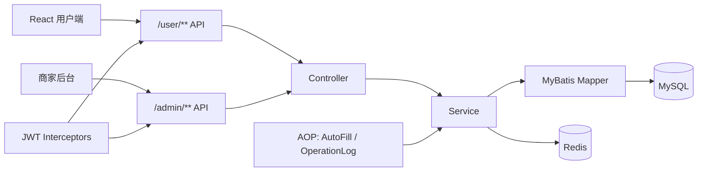

## 目录结构

```text
.
├── docs/
│   ├── local-explorer-init.sql     # 数据库结构与演示数据
│   └── local-explorer-sample-data.sql
├── docker-compose.yml              # MySQL + Redis 本地环境
├── explorer-common/                # 常量、异常、通用结果、工具、配置属性
├── explorer-model/                 # DTO / Entity / VO
└── explorer-web/                   # Controller / Service / Mapper / AOP / React 前端与静态产物
    └── frontend/                   # React + Vite 多入口前端工程
```

## 数据模型

```text
category
  ├── explore_item
  │     └── explore_item_tag
  └── explore_package
        └── explore_package_item

user
  ├── explore_order
  │     └── order_event_outbox
  │           └── user_notification
  └── review

employee
auth_session
login_guard
operation_log
runtime_setting
```

核心关系：

- 一个分类下可以包含多个特色项目或探店套餐。
- 一个套餐可以关联多个特色项目。
- 用户可以对项目或套餐发起预约。
- 用户可以对项目或套餐订单进行评价。
- 用户可以收藏和浏览特色项目。
- 后台写操作会记录到操作日志。
- 订单状态变化在同一事务写入Outbox，最终生成用户通知。

## 一键运行

只看前端演示，不需要启动后端：

```powershell
.\run.cmd
```

连接 IDEA 里启动的后端：

```powershell
.\run.cmd dev
```

`.\run.cmd` 会打开 `?demo=1` 演示页面，适合面试先看界面和业务闭环。`.\run.cmd dev` 会启动 Vite 前端开发服务，请先在 IDEA 中启动后端 `LocalExplorerApplication`，前端会通过 Vite 代理访问 `http://localhost:8080`。

前端入口：

- 商家后台：<http://127.0.0.1:5173/console/login.html>
- 用户端：<http://127.0.0.1:5173/client/login.html>

对应脚本：

```powershell
powershell -NoProfile -ExecutionPolicy Bypass -File scripts\run-demo.ps1
powershell -NoProfile -ExecutionPolicy Bypass -File scripts\run-frontend.ps1
```

默认账号：

```text
admin / 123456
13800001111 / 123456
```

## 快速启动

### 本机最简单运行方式

首次运行或想重置演示数据时，先在项目根目录打开一个 PowerShell：

```powershell
cmd /c 'mysql -u root -p1234 -e "DROP DATABASE IF EXISTS local_explorer"'
cmd /c 'mysql -u root -p1234 < docs\local-explorer-init.sql'
```

然后用 IDEA 打开项目根目录，运行 `com.localexplorer.LocalExplorerApplication`。看到`Tomcat started on port(s): 8080`后，在PowerShell验证依赖状态：

```powershell
Invoke-RestMethod http://localhost:8080/actuator/health | ConvertTo-Json -Depth 5
```

总体`UP`表示MySQL和Redis都可用；总体`DEGRADED`且Redis组件为`l1-mysql-fallback`表示MySQL正常、公共浏览已回退到Caffeine/MySQL，核心流程仍能运行；总体`DOWN`或HTTP 503通常需要检查MySQL。

再新开一个 PowerShell，到项目根目录输入：

```powershell
.\run.cmd dev
```

浏览器打开：

- 管理端：<http://127.0.0.1:5173/console/login.html>
- 用户端：<http://127.0.0.1:5173/client/login.html>

以后日常运行不用重复导库：IDEA 启动后端，再执行 `.\run.cmd dev` 即可。

### 最短跑通路径

按下面顺序跑：

1. 安装JDK 8/17/21、Node.js、IDEA、MySQL 8；建议安装Redis 7以展示完整两级缓存和持久行为记录。
2. 启动MySQL并确认端口是`3306`。Redis未启动时公共浏览仍会快速回退到L1/MySQL，但跨实例L2和持久浏览/收藏记录不可用。
3. 在项目根目录初始化数据库：

   ```powershell
   cmd /c 'mysql -u root -p1234 -e "DROP DATABASE IF EXISTS local_explorer"'
   cmd /c 'mysql -u root -p1234 < docs\local-explorer-init.sql'
   ```

4. 后端用 IDEA 打开当前项目根目录，运行 `com.localexplorer.LocalExplorerApplication`。如果本机有旧环境变量，Run Configuration 里加 `DB_NAME=local_explorer;DB_PASSWORD=1234`。
5. 新开一个 PowerShell，在项目根目录启动前端：

   ```powershell
   .\run.cmd dev
   ```

6. 浏览器打开：

   - 管理端：<http://127.0.0.1:5173/console/login.html>
   - 用户端：<http://127.0.0.1:5173/client/login.html>

日常本地运行不用重复导库：IDEA 里运行 `LocalExplorerApplication`，再新开 PowerShell 到项目根目录执行 `.\run.cmd dev`。

### 发给别人前清理

不要把本地依赖缓存、构建产物和运行日志一起打包。确认项目里没有这些目录或文件：

```text
.m2/
.mvn/wrapper/apache-maven-*/
explorer-web/frontend/node_modules/
**/target/
*.log
```

这些都是运行或构建时生成的内容；保留源码、`mvnw.cmd`、`.mvn/wrapper/maven-wrapper.properties`、`package.json` 和 `package-lock.json` 即可。别人首次运行时会重新下载 Maven 和 npm 依赖。

### 环境要求

- JDK 8、17 或 21。IDEA 如果使用 `openjdk-24`，请确认 Maven 已刷新到 `lombok 1.18.44`。
- Node.js / npm
- IDEA
- MySQL 8；Redis 7 建议启动，用于持久浏览/收藏记录和缓存（可用本机服务，也可用 Docker Desktop 启动）

如果本机同时安装了 JRE 和 JDK，请确认 IDEA 使用的是 JDK。Spring Boot 2.7 项目不需要使用过新的预览版 JDK。

### 1. 准备 MySQL 和 Redis

本机 MySQL 和 Docker MySQL 二选一即可。若本机已经有 MySQL 占用 `3306`，不要再执行 `docker compose up -d` 启动 Docker MySQL，直接走下面的“本机 MySQL 手动执行”路径。

如果使用 Docker，可以运行：

```powershell
docker compose up -d
```

该命令会启动：

- MySQL 8：`localhost:3306`，账号 `root`，密码 `1234`
- Redis 7：`localhost:6379`
- MySQL 首次启动时自动执行 `docs/local-explorer-init.sql`

如果不用 Docker，也可以在本机 MySQL 手动执行。PowerShell 不能直接使用 `<` 重定向，需要通过 `cmd /c`：

```powershell
cmd /c 'mysql -u root -p1234 < docs\local-explorer-init.sql'
```

如果本机已经有旧的 `local_explorer` 库，建议先删库重建，避免旧表结构缺字段：

```powershell
cmd /c 'mysql -u root -p1234 -e "DROP DATABASE IF EXISTS local_explorer"'
cmd /c 'mysql -u root -p1234 < docs\local-explorer-init.sql'
```

`-p1234` 是默认密码，`-p` 和密码中间不要加空格。如果你的 MySQL root 密码不是 `1234`，替换成自己的密码。

### 2. 后端用 IDEA 启动

1. IDEA 打开当前项目根目录
2. 确认 `application-dev.yml` 中的 MySQL / Redis 配置可用
3. 运行 `com.localexplorer.LocalExplorerApplication`
4. 后端地址：<http://localhost:8080>

如果本机有旧环境变量，例如 `DB_NAME=agent_studio`，可以在 IDEA 的 `Run/Debug Configurations` 中临时覆盖：

- `Program arguments` 填：`--explorer.datasource.database=local_explorer`
- 或 `Environment variables` 填：`DB_NAME=local_explorer;DB_PASSWORD=1234`

### 3. 前端启动

纯前端演示：

```powershell
.\run.cmd
```

连接 IDEA 后端：

```powershell
.\run.cmd dev
```

`dev` 模式会启动 Vite，浏览器访问 `127.0.0.1:5173`，接口请求会代理到 IDEA 后端 `localhost:8080`。

默认后台账号：

```text
admin / 123456
```

默认用户账号：

```text
13800001111 / 123456
```

### 4. 配置环境变量

可参考 `.env.example` 或 `explorer-web/src/main/resources/application-dev.example.yml`。

常用变量：

```bash
export DB_HOST=localhost
export DB_PORT=3306
export DB_NAME=local_explorer
export DB_USERNAME=root
export DB_PASSWORD=1234
export REDIS_HOST=localhost
export REDIS_PORT=6379
export REDIS_DATABASE=10
export JWT_ADMIN_SECRET=replace-with-admin-secret
export JWT_USER_SECRET=replace-with-user-secret
```

### 5. 无数据库展示模式

如果只需要展示 UI 或补截图，可以使用 `.\run.cmd`，或在 Vite 页面后追加 `?demo=1`。该模式使用前端内置演示数据，不需要先启动 MySQL、Redis 或后端服务：

- 商家后台：<http://127.0.0.1:5173/console/index.html?demo=1>
- 特色项目管理：<http://127.0.0.1:5173/console/items.html?demo=1>
- 用户端：<http://127.0.0.1:5173/client/index.html?demo=1>

## 常见报错

| 现象 | 原因 | 处理 |
| --- | --- | --- |
| PowerShell 提示 `RedirectionNotSupported` 或 `"<" 运算符是为将来使用而保留的` | PowerShell 不支持 `mysql -u root -p < docs/local-explorer-init.sql` 这种输入重定向写法 | 使用 `cmd /c 'mysql -u root -p1234 < docs\local-explorer-init.sql'` |
| `ERROR 1054 (42S22): Unknown column 'password' in 'field list'` | 本机已有旧版 `local_explorer.user` 表，`CREATE TABLE IF NOT EXISTS` 不会覆盖旧结构 | 执行 `cmd /c 'mysql -u root -p1234 -e "DROP DATABASE IF EXISTS local_explorer"'`，再重新导入 `docs\local-explorer-init.sql` |
| 后台新增/编辑项目或用户管理时报 `Unknown column 'duration_minutes'`、`Unknown column 'capacity'`、`Unknown column 'booked'` 或 `Unknown column 'status'` | 代码已增加时长、容量、商圈、集合点、用户启用状态等字段，但本机旧表没有这些列 | 不想清空数据时执行 `cmd /c 'mysql -u root -p1234 local_explorer < docs\local-explorer-migrate.sql'`；全新演示库可重新导入 `docs\local-explorer-init.sql` |
| 后台回复评价时显示`未知错误`，后端日志有`Unknown column 'reply_content' in 'field list'` | 本机旧版`review`表缺少商家回复字段 | 执行`cmd /c 'mysql -u root -p1234 local_explorer < docs\local-explorer-migrate.sql'`；迁移可重复执行且不会清空现有数据 |
| 启动后日志报`Unknown column 'lock_token'`、`Table 'local_explorer.order_event_outbox' doesn't exist`或`Table 'local_explorer.user_notification' doesn't exist` | 本机数据库创建于订单可靠性功能之前 | 执行`cmd /c 'mysql -u root -p1234 local_explorer < docs\local-explorer-migrate.sql'`后重启后端；已有订单和用户数据不会被清空 |
| 登录或刷新时报`Table 'local_explorer.auth_session' doesn't exist`或`Table 'local_explorer.login_guard' doesn't exist` | 本机数据库创建于服务端会话功能之前 | 执行`cmd /c 'mysql -u root -p1234 local_explorer < docs\local-explorer-migrate.sql'`后重启后端；无需删除现有业务数据 |
| 保存商户资料或营业状态时显示`未知错误`，后端日志有`Table 'local_explorer.runtime_setting' doesn't exist` | 本机数据库创建于运行配置持久化功能之前 | 执行`cmd /c 'mysql -u root -p1234 local_explorer < docs\local-explorer-migrate.sql'`，无需删库；随后重启后端 |
| Docker 报 `ports are not available`、`3306 被占用` 或 `bind: Only one usage of each socket address...` | 本机已有 MySQL 或其他服务占用了 `3306`，Docker MySQL 不能再绑定同一个端口 | 不用 Docker MySQL，直接使用本机 MySQL：先执行 `DROP DATABASE IF EXISTS local_explorer`，再导入 `docs\local-explorer-init.sql` |
| 登录后台显示 `未知错误`，后端日志有 `Table 'agent_studio.employee' doesn't exist` | 后端连接到了错误数据库，或数据库没有初始化表 | IDEA 运行配置里删除错误的 `DB_NAME`，或设置 `DB_NAME=local_explorer`；然后执行初始化 SQL |
| 前端提示 `后端服务未启动或 8080 端口不可达` | Vite dev 代理访问 `localhost:8080`，但 IDEA 后端没有启动或端口不对 | 在 IDEA 启动 `LocalExplorerApplication`，确认日志里有 `Tomcat started on port(s): 8080` |
| Maven Wrapper 报 `End of Central Directory record could not be found` | Maven压缩包下载中断，留下了不完整缓存 | 重新执行`.\mvnw.cmd -version`；当前Wrapper会自动校验、删除损坏缓存并从Maven Central重新下载。若终端仍占用旧文件，先关闭正在运行的`mvnw.cmd`窗口再重试 |
| 后端启动报 `Port 8080 was already in use` | 已经有旧后端或其他程序占用了 8080 | 先停止 IDEA 里正在运行的后端；或执行 `jps -l` 找到 `LocalExplorerApplication` 的 PID，再用 `taskkill /PID 进程号 /F` 停掉旧进程 |
| 收藏、浏览记录或缓存日志报`RedisConnectionFailureException` / `Connection refused` | Redis没启动或端口不是`6379` | 核心流程会在200ms内降级；公共浏览走Caffeine/MySQL，收藏/浏览记录临时保存在JVM内存。Redis恢复后公共缓存会自动重新填充，无需重启后端 |
| 真实后端链路smoke在`/user/explore-item/list`等列表接口返回`未知错误` | 8080上跑的可能是旧后端进程，或Redis未启动且旧进程未加载缓存降级配置 | 先停止IDEA里的旧后端，重新运行`LocalExplorerApplication`；仍失败就启动Redis 7或检查`6379`端口 |
| IDEA 构建报 `java.lang.ExceptionInInitializerError`、`com.sun.tools.javac.code.TypeTag :: UNKNOWN` | IDEA 使用 `openjdk-24`，但 Maven 依赖或缓存里的 Lombok 太旧 | 确认根 `pom.xml` 是 `lombok 1.18.44`，点击 Maven 面板的 `Maven Reload`，再 `Build > Rebuild Project` |
| Maven 面板能看到项目，但运行后端仍连旧库 | IDEA 运行配置或系统环境变量覆盖了 `application-dev.yml` | 检查 Run Configuration 的 Environment variables，确保 `DB_NAME=local_explorer`、`DB_PASSWORD=1234`，或在 Program arguments 加 `--explorer.datasource.database=local_explorer` |
| PowerShell 里执行 `$env:DB_NAME='local_explorer'` 后，IDEA 仍连旧库 | IDEA 已经打开，不会继承后续 PowerShell 窗口里的临时环境变量 | 在 IDEA Run Configuration 里设置 `DB_NAME=local_explorer`，或关闭 IDEA 后从同一个 PowerShell 窗口启动 IDEA |
| `mysql` 命令找不到 | MySQL bin 目录没有加入 PATH | 用 MySQL 安装目录下的完整路径执行，或把 `MySQL Server 8.0\bin` 加入系统 PATH |
| 登录账号密码不确定 | 初始化 SQL 内置了演示账号 | 后台账号 `admin / 123456`，用户端账号 `13800001111 / 123456` |

## 测试

当前测试覆盖后端服务、分页参数边界、认证隔离、用户行为记录、运行配置持久化、操作日志、异常处理、React入口、演示数据和README定位：

| 测试 | 覆盖点 |
| --- | --- |
| `EmployeeServiceImplTest` / `AdminEmployeeControllerTest` | 员工登录、详情/编辑缺失校验、状态参数校验、审计日志引用保护，以及默认管理员保护 |
| `UserServiceImplTest` | 用户手机号密码登录、账号不存在、密码错误和账号启停校验 |
| `AuthControllerValidationTest` / `AuthControllerSessionTest` / `AuthenticationServiceTest` | 双端登录校验、Cookie属性、refresh/logout、Origin、requestId、统一登录失败和账号禁用撤销 |
| `AuthSessionServiceImplTest` / `LoginProtectionServiceTest` / `AuthSessionCleanupJobTest` | 会话签发、CAS轮换、重放撤销、锁定窗口、清理任务和低基数指标 |
| `WriteDtoValidationTest` / `WriteControllerValidationTest` | 分类、项目、套餐、员工、用户、评价和商户资料的必填、长度、数值范围与写接口校验 |
| `PageQueryValidationTest` / `PageControllerValidationTest` | 分页DTO默认值、页码/每页数量上限、筛选参数范围，以及分页接口在进入业务层前拦截非法分页 |
| `SensitiveFieldSerializationTest` | 员工/用户密码禁止序列化，以及员工分页不读取密码列 |
| `JwtTokenInterceptorTest` | 管理端/用户端JWT隔离、跨端token拒绝、禁用或删除账号立即撤销旧会话、认证上下文清理 |
| `AdminAuthorizationInterceptorTest` | ADMIN放行、STAFF越权返回403，以及员工、用户、日志和敏感导出权限边界 |
| `UserInteractionServiceImplTest` | 浏览记录淘汰、浏览/收藏批量查库与 Redis 顺序回填、收藏/取消收藏/计数、Redis 不可用时内存降级 |
| `CategoryServiceImplTest` | 分类默认排序、缺失分类编辑/删除拦截、关联引用删除保护、已关联分类禁止修改type，以及启停ID和状态参数校验 |
| `ExploreItemServiceImplTest` / `ExplorePackageServiceImplTest` | 项目/套餐详情与编辑缺失校验、启停校验、分类类型校验、历史引用保护、套餐关联约束，以及预约人数维护 |
| `ExploreOrderServiceImplTest` | 预约详情缺失校验、原子占用/释放名额、requestId幂等与唯一键竞争、并发状态迁移和状态流转约束 |
| `ExpiredOrderProcessorTest` / `OrderExpirationJobTest` | 超时边界、到期CAS、容量释放回滚、逐单事务、失败隔离、batchId和指标 |
| `OutboxEventTransactionServiceTest` / `OutboxDispatchJobTest` | 租约令牌、通知事务、指数退避、DEAD、失败隔离和重复处理 |
| `UserNotificationControllerTest` / `AdminOutboxEventControllerTest` | 通知用户隔离、分页/已读、ADMIN运维权限和稳定错误码 |
| `BookingApiFlowTest` | MockMvc串起真实Controller和Service，验证创建、重复提交、后台确认、用户取消和订单归属失败 |
| `BookingMySqlIT` / `AuthSessionMySqlIT` | Testcontainers真实MySQL下验证业务可靠性，以及Refresh摘要唯一、并发轮换、重放整族撤销和事务回滚 |
| `UserExploreOrderControllerTest` | 非法人数、空联系人、错误手机号和过去预约时间在进入Service前拦截 |
| `ReviewServiceImplTest` | 已完成项目/套餐订单评价、订单归属校验、重复评价拦截、评分范围校验 |
| `RuntimeSettingServiceTest` | 门店状态和商户资料写入MySQL、营业状态参数校验、跨服务实例恢复、落库失败不伪成功 |
| `DashboardServiceTest` | 运营概览7天趋势、空日期补零、汇总指标、待确认预约数、确认收入、完成/取消和完成率 |
| `HotReadCacheServiceTest` / `CacheInvalidationCoordinatorTest` | L1/L2/DB、空值、绝对TTL、100线程single-flight、锁续租、故障恢复、提交后失效和回滚不失效 |
| `CacheOpsControllerTest` / `HotCacheMySqlRedisIT` | ADMIN运维权限，以及真实MySQL/Redis双上下文锁、跨实例失效、坏值和停机恢复 |
| `RedisConfigurationTest` | Redis连接超时、字符串缓存客户端和跨实例失效监听配置 |
| `RedisFallbackHealthIndicatorTest` | Redis正常为UP、不可用为DEGRADED，健康响应不泄露连接信息 |
| `RuntimeSettingControllerWiringTest` | 管理端和用户端门店/商家接口统一走运行时配置服务 |
| `OperationLogServiceImplTest` | 操作日志异步执行配置、日志入库、入库失败不影响主流程 |
| `OperationLogAspectTest` / `operation-log-contract.test.cjs` | 管理端写接口注解覆盖、中文日志文案、仅成功结果入库，失败操作不伪记成功 |
| `ExportJobStatusTest` / `ExportJobServiceImplTest` / `ExportJobProcessorTest` | 异步导出状态矩阵、requestId幂等、权限、CAS领取、续租、恢复、取消和重试 |
| `ExportFileGeneratorTest` / `LocalExportFileStorageTest` / `ExportJobCleanupTaskTest` | CSV/XLSX流式写入、公式注入、资源上限、路径边界、SHA-256和过期清理 |
| `ExportJobMySqlIT` / `ExportFileGeneratorPerformanceIT` | 真实MySQL索引与并发、10000行双格式，以及100000行有界内存性能证据 |
| `GlobalExceptionHandlerTest` | 400/401/403/409/500/503与稳定code映射，SQL约束和未知异常不泄露内部信息 |
| `react-frontend.test.cjs` | React/Vite 工程入口、登录隔离、用户端收藏取消、旧移动端定位残留清理 |
| `frontend-input-validation.test.cjs` | 管理端和用户端表单必填、长度、手机号、价格、容量等前端输入边界 |
| `demo-data.test.cjs` | 静态展示模式开关、演示登录态、后台/用户端演示数据、收藏状态变更和业务化展示字段 |
| `login-pages.test.cjs` | 管理员登录页和用户登录页分离、用户端认证跳转 |
| `readme-positioning.test.cjs` | README 演示路径、项目定位和验证结果 |
| `run-scripts.test.cjs` | 前端运行脚本、IDEA 后端开发路径和 README 运行入口 |
| `data-integrity.test.cjs` | 新库外键约束，项目、套餐、员工历史引用查询契约，以及套餐明细`itemId`回读契约 |
| `scripts\smoke-demo-pages.ps1` | 使用本机 Chrome/Edge 无头浏览器渲染后台和用户端关键页面，检查 React 页面不是空白壳 |
| `scripts\smoke-demo-interactions.ps1` | 使用本机 Chrome/Edge DevTools 协议点击后台和用户端关键流程 |
| `scripts\smoke-backend-chain.ps1` | 验证 IDEA 后端的登录、创建预约、后台确认、用户取消链路 |
| `scripts\smoke-admin-management.ps1` | 验证后台分类、项目、套餐、员工的CRUD、用户/员工启停用接口，以及成功/失败写操作的审计结果 |
| `scripts\smoke-runtime-settings.ps1` | 验证商户资料、营业状态、双端回读、操作日志和原状态恢复 |
| `scripts\smoke-critical-consistency.ps1` | 验证并发预约不超卖、取消后名额恢复，以及用户/员工禁用后旧token立即失效 |
| `scripts\smoke-order-reliability.ps1` | 验证重复requestId、系统超时、容量恢复、Outbox通知和已读闭环 |
| `scripts\smoke-auth-session.ps1` / `npm run smoke:auth` | 验证双端轮换、重放、退出、锁定/解锁，以及真实浏览器自动续期和退出不可恢复 |
| `scripts\smoke-cache-performance.cjs` | 冷态、热态和预热后各至少200次请求，输出p50/p95/p99、吞吐、命中率和数据库回源次数 |

运行：

```powershell
.\mvnw.cmd test
node --test explorer-web\src\test\js\*.test.cjs
```

默认测试不需要Docker。Docker Desktop已启动时，再跑真实MySQL和Redis集成测试：

```powershell
.\mvnw.cmd verify -Pintegration-test
```

前端展示 smoke test 会直接启动本机 Chrome/Edge 做无头浏览器渲染，检查后台订单、评价、用户端首页和我的预约等页面是否真正渲染出关键内容：

```powershell
powershell -NoProfile -ExecutionPolicy Bypass -File scripts\smoke-demo-pages.ps1
```

关键点击流程 smoke test 会通过 Chrome/Edge DevTools 协议实际点击后台订单详情、后台评价筛选和用户端预约详情：

```powershell
powershell -NoProfile -ExecutionPolicy Bypass -File scripts\smoke-demo-interactions.ps1
```

真实后端链路 smoke test 需要先在 IDEA 启动 `LocalExplorerApplication`，并确认 MySQL 已初始化。它会登录后台和用户端，创建一条 `Smoke自检` 预约，后台确认后再由用户端取消；数据库会保留一条已取消的自检订单作为链路证据：

```powershell
powershell -NoProfile -ExecutionPolicy Bypass -File scripts\smoke-backend-chain.ps1
```

后台管理CRUD smoke test会登录管理员，临时创建分类、项目、套餐和员工，实际执行编辑、启停用、删除接口，并核对成功操作日志以及失败写操作不会伪记成功；脚本结束会清理临时数据：

```powershell
powershell -NoProfile -ExecutionPolicy Bypass -File scripts\smoke-admin-management.ps1
```

用户互动与评价smoke test会复用初始化数据中的“已完成待评价”项目订单和套餐订单，实际验证浏览记录、收藏增删与状态同步、项目/套餐评价、商家回复以及用户端回读。临时评价和收藏状态会在结束时清理，不新增预约，也不会消耗项目或套餐名额：

```powershell
powershell -NoProfile -ExecutionPolicy Bypass -File scripts\smoke-user-engagement.ps1
```

运行配置smoke test会修改商户资料和营业状态，验证管理端/用户端同步与操作日志，结束时自动恢复原值：

```powershell
powershell -NoProfile -ExecutionPolicy Bypass -File scripts\smoke-runtime-settings.ps1
```

关键一致性smoke test会把一个现有项目的容量临时收紧到仅剩1个名额，同时发起2次预约，确认仅1次成功且取消后名额恢复；随后验证用户和员工账号禁用后旧token立即返回401。项目容量、用户状态和门店状态会在`finally`中恢复，临时员工会删除：

```powershell
powershell -NoProfile -ExecutionPolicy Bypass -File scripts\smoke-critical-consistency.ps1
```

订单可靠性smoke会真实提交两次相同`requestId`，等待系统超时关闭，核对容量恢复、`ORDER_EXPIRED`通知和已读状态。先在IDEA运行配置中临时设置`ORDER_PENDING_TIMEOUT_MINUTES=1;ORDER_EXPIRATION_DELAY_MS=1000;OUTBOX_DELAY_MS=500`并重启后端：

```powershell
powershell -NoProfile -ExecutionPolicy Bypass -File scripts\smoke-order-reliability.ps1
```

认证会话smoke会真实验证双端登录、Refresh轮换、过宽限期重放整族撤销、logout、logout-all、HTTP 429锁定和ADMIN解锁；无需修改业务数据：

```powershell
powershell -NoProfile -ExecutionPolicy Bypass -File scripts\smoke-auth-session.ps1
Set-Location explorer-web\frontend
npm run smoke:auth
```

缓存性能smoke要求MySQL、Redis和后端已启动。它会失效公共缓存、执行三组真实HTTP请求并将报告写入`explorer-web/target/cache-performance-report.json`：

```powershell
Set-Location explorer-web\frontend
npm run smoke:cache-performance
```

普通开发不设置这些变量时，待确认订单默认保留30分钟。

如果后端端口不是 `8080`：

```powershell
powershell -NoProfile -ExecutionPolicy Bypass -File scripts\smoke-backend-chain.ps1 -BaseUrl "http://localhost:18080"
powershell -NoProfile -ExecutionPolicy Bypass -File scripts\smoke-admin-management.ps1 -BaseUrl "http://localhost:18080"
powershell -NoProfile -ExecutionPolicy Bypass -File scripts\smoke-critical-consistency.ps1 -BaseUrl "http://localhost:18080"
powershell -NoProfile -ExecutionPolicy Bypass -File scripts\smoke-order-reliability.ps1 -BaseUrl "http://localhost:18080"
```

如果浏览器不在默认安装路径，可以显式传入：

```powershell
powershell -NoProfile -ExecutionPolicy Bypass -File scripts\smoke-demo-pages.ps1 -EdgePath "C:\Program Files (x86)\Microsoft\Edge\Application\msedge.exe"
powershell -NoProfile -ExecutionPolicy Bypass -File scripts\smoke-demo-interactions.ps1 -EdgePath "C:\Program Files (x86)\Microsoft\Edge\Application\msedge.exe"
```

## 最近验证

最近一次完整验证结果：

```text
Maven tests: 339 run, 0 failures, 0 errors, 0 skipped
Node frontend/docs/run tests: 151 passed
Testcontainers MySQL + Redis: 34 run, 0 failures, 0 errors, 0 skipped
Frontend dependency install: npm ci succeeded
Frontend dependency audit: 0 vulnerabilities
Cache performance smoke: 600 requests, cold MySQL loads 1, hot/prewarmed MySQL loads 0, hot hit rate 100%
UI smoke: 6 rendered pages, 18 text checks
Interaction smoke: 6 flows, including loaded project images
Backend static assets: /console/index.html and /assets/app resources returned 200
Backend entry redirects: /, /console and /client route to login entries
Backend chain smoke: admin/user login, create order, admin confirm, user cancel
Backend smoke without Redis: backend chain + admin CRUD completed in 3.56s
Admin management smoke: category/item/package/employee CRUD, packageItems persistence and user/employee status endpoints
Missing-resource smoke: 9 detail/edit/delete paths rejected with business errors
User engagement smoke: browse, favorite, completed project and package review fixtures, merchant reply and user read-back; no booking capacity consumed
Runtime settings smoke: merchant and shop state survive restart, admin/user read-back, operation logs persisted
Operation log audit: protected admin writes covered; failed writes are not recorded as success
Booking concurrency smoke: 2 concurrent requests, 1 success, booked count restored after cancel
Order reliability smoke: duplicate requestId, scheduled timeout, capacity restored, ORDER_EXPIRED notification visible and readable
Session revocation smoke: disabled employee/user tokens return 401 immediately
Authentication API smoke: refresh rotation, replay family revocation, logout, logout-all, HTTP 429 lockout and ADMIN unlock passed
Authentication Playwright: admin desktop and user mobile login, reload recovery, expired Access recovery and logout passed
MockMvc booking flow: create, duplicate requestId, admin confirm, user cancel and ownership rejection passed
RBAC: ADMIN allowed; STAFF receives 403 for employee, user, operation-log and sensitive export boundaries
Async export: requestId idempotency, CAS lease claim, heartbeat, crash recovery, bounded retry, cancel and expiry cleanup passed
Export security: PII snapshot encryption, masked phone, formula defense, path/symlink boundary and SHA-256 verification passed
Export performance: real MySQL 10000-row CSV/XLSX and synthetic 100000-row streaming CSV/XLSX passed
Error contract: stable 40000/40100/40300/40900/50000/50300 codes; SQL and stack details stay server-side
Hot-cache concurrency: 100 cold readers, 1 database load; distributed lock lease renewal covered
Hot-cache integration: two Spring contexts, real MySQL/Redis, cross-instance invalidation, Redis pause and recovery covered
Health check: MySQL component plus Redis UP/DEGRADED l1-mysql-fallback state covered
Observability: X-Request-Id, MDC access logs, HTTP timing and booking Prometheus metrics covered
Reliable event observability: batchId logs, expiration/outbox counters and timers, backlog gauges and DEAD degradation covered
Frontend build: Vite production build succeeded
Playwright notification smoke: desktop 1280x900 and mobile 375x812 passed
Playwright authentication screenshots: admin 1366x900 and user 375x812 passed visual inspection
Playwright export jobs: real create/wait/download/cancel/file-limit failure/retry/polling cleanup plus demo failed/retry on desktop and mobile passed
BUILD SUCCESS
```

## 核心设计说明

### 认证隔离

`WebMvcConfiguration` 注册了两个 JWT 拦截器：

- `JwtTokenAdminInterceptor`：保护 `/admin/**`
- `JwtTokenUserInterceptor`：保护 `/user/**`

管理端和用户端使用不同token header、secret、Refresh Cookie Path与`principalType`，避免两类身份混用。Access JWT默认30分钟并绑定`auth_session`；Refresh Token默认7天、仅以SHA-256摘要落库，每次刷新通过CAS轮换。过2秒并发宽限后再次使用旧Token会撤销整个token family。logout、logout-all、账号禁用/删除和密码重置都能让现有会话立即失效。完整设计见[双端认证与会话安全](docs/AUTH_SESSION_SECURITY.md)。

### RBAC授权

管理端员工分为`ADMIN`和`STAFF`。`@RequireAdmin`由`AdminAuthorizationInterceptor`统一处理员工、用户、操作日志、缓存和安全运维等高风险接口；STAFF保留内容、预约、评价、商户和营业状态等日常运营能力。异步导出在Service层继续执行任务归属校验：STAFF可创建订单/评价导出并管理自己的任务，用户/操作日志等敏感导出仅ADMIN可创建。完整设计见[异步导出与任务调度中心](docs/ASYNC_EXPORT.md)。

### 订单状态机与可靠事件

订单状态集中定义为待确认、已确认、已完成、已取消和系统超时取消。确认、完成、用户取消、管理员取消和系统超时都使用数据库CAS；需要释放容量的状态变化会把状态、容量和Outbox事件放在同一事务。

超时任务由Spring Scheduling触发，ShedLock JDBC避免多实例重复调度，每个订单使用独立事务。Outbox处理使用`locked_until + lock_token`租约，失败按指数退避重试，超过上限进入DEAD；ADMIN可查询统计和手动重试。通知表以`event_id`唯一约束保证重复消费不产生重复消息。完整设计见[订单可靠性设计](docs/ORDER_RELIABILITY.md)。

### 错误码与健康检查

成功响应保持`code = 1`，失败使用稳定错误码：参数40000、认证40100、权限40300、业务冲突40900、系统异常50000、数据库不可用50300。HTTP状态与业务code一致，未知异常、SQL和连接信息不会写入响应体。

`GET /actuator/health`展示MySQL组件和Redis缓存状态。Redis不可用时返回`DEGRADED`与`l1-mysql-fallback`且HTTP仍为200；MySQL不可用时整体为`DOWN`。

### Redis ZSet 行为记录

浏览记录和收藏记录使用 Redis ZSet：

- key：`user:{userId}:browse` / `user:{userId}:favorite`
- member：`itemId`
- score：毫秒时间戳

这样可以直接获得：

- 倒序分页：`ZREVRANGE`
- 去重更新：`ZADD`
- 是否收藏：`ZSCORE`
- 总数统计：`ZCARD`
- 浏览记录上限淘汰：`ZREMRANGEBYRANK`

Redis 连接异常时，服务层会降级到 JVM 内存记录，保证用户端收藏、浏览、计数接口不返回 500。该降级只用于本地演示和容错，应用重启后临时记录会丢失；正式展示完整链路时仍建议启动 Redis。

### 缓存策略

公共浏览采用`Caffeine L1 -> Redis L2 -> MySQL`：

| 层级 | 默认边界 | 保护机制 |
| --- | --- | --- |
| L1 | 最多2000条、20秒新鲜周期 | Caffeine容量限制、短TTL |
| L2 | 10分钟并带随机抖动 | JSON结构版本、命名空间版本、空值缓存 |
| 回源 | MySQL事实数据 | 单机single-flight、Redis分布式锁与watchdog续租 |

分类、项目、套餐、商户资料和营业状态写入后，通过`TransactionSynchronization.afterCommit`执行依赖失效；回滚不删除缓存。列表递增命名空间版本，详情精确删除，Pub/Sub通知其他实例清理L1。Redis不可用时短时熔断到L1/MySQL，恢复后自动重新填充L2。完整设计和一致性边界见[公共浏览热路径](docs/CACHE_HOT_PATH.md)。

### AOP 能力

- `@AutoFill`：Mapper 写操作前自动填充 `createTime`、`updateTime`、`createUser`、`updateUser`。
- `@OperationLog`：记录后台写操作的描述、操作者、URI、IP、耗时，并持久化到 `operation_log`。

## API 概览

### 商家后台

| 方法 | 路径 | 说明 |
| --- | --- | --- |
| POST | `/admin/employee/login` | 员工登录 |
| POST | `/admin/employee` | 新增员工 |
| GET | `/admin/employee/page` | 员工分页查询 |
| PUT | `/admin/employee` | 编辑员工 |
| POST | `/admin/employee/status/{status}` | 启用/禁用员工 |
| DELETE | `/admin/employee?id={id}` | 删除员工，默认管理员不可删除 |
| GET/PUT | `/admin/merchant/info` | 商家信息查询/修改 |
| PUT | `/admin/shop/{status}` | 设置营业状态 |
| CRUD | `/admin/category/**` | 分类管理 |
| CRUD | `/admin/explore-item/**` | 特色项目管理 |
| CRUD | `/admin/explore-package/**` | 套餐管理 |
| GET/PUT | `/admin/user-manage/**` | 用户查询、编辑、重置密码 |
| POST | `/admin/user-manage/status/{status}` | 启用/禁用用户 |
| GET | `/admin/explore-order/page` | 预约分页查询 |
| GET | `/admin/operation-log/page` | 操作日志分页查询 |
| GET | `/admin/outbox-event/page` | Outbox事件分页，仅ADMIN |
| GET | `/admin/outbox-event/stats` | Outbox状态统计，仅ADMIN |
| PUT | `/admin/outbox-event/{id}/retry` | 重试DEAD事件，仅ADMIN |
| GET | `/admin/cache/stats` | 两级缓存统计，仅ADMIN |
| POST | `/admin/cache/invalidate/{domain}` | 指定业务域失效，仅ADMIN |
| POST | `/admin/cache/warmup` | 异步预热首页，仅ADMIN |
| POST | `/admin/export-jobs` | 创建CSV/XLSX异步导出任务 |
| GET | `/admin/export-jobs/page` | 任务分页，STAFF仅可见自己的任务 |
| POST | `/admin/export-jobs/{jobId}/cancel` | 取消待执行或运行中任务 |
| POST | `/admin/export-jobs/{jobId}/retry` | 重试失败任务 |
| GET | `/admin/export-jobs/{jobId}/download` | 鉴权并校验SHA-256后下载 |
| GET | `/admin/export-jobs/stats` | 导出状态统计，仅ADMIN |

### 用户端

| 方法 | 路径 | 说明 |
| --- | --- | --- |
| POST | `/user/user/login` | 用户手机号密码登录 |
| GET | `/user/merchant/info` | 商家信息 |
| GET | `/user/shop/status` | 门店状态 |
| GET | `/user/category/list` | 分类列表 |
| GET | `/user/explore-item/list` | 特色项目列表 |
| GET | `/user/explore-package/list` | 套餐列表 |
| POST | `/user/favorite/browse/{itemId}` | 添加浏览记录 |
| GET | `/user/favorite/browse` | 浏览记录分页 |
| POST | `/user/favorite/{itemId}` | 收藏项目 |
| DELETE | `/user/favorite/{itemId}` | 取消收藏 |
| GET | `/user/favorite` | 收藏列表分页 |
| POST | `/user/explore-order` | 创建预约 |
| GET | `/user/notification/page` | 我的通知分页 |
| GET | `/user/notification/unread-count` | 未读通知数 |
| PUT | `/user/notification/{id}/read` | 标记通知已读 |
| POST | `/user/review` | 新增评价 |

## 展示材料

截图放在 `docs/screenshots/`，当前已补充可直接用于 GitHub 展示的界面图：

| 商家后台登录 | 商家后台运营概览 |
| --- | --- |
| 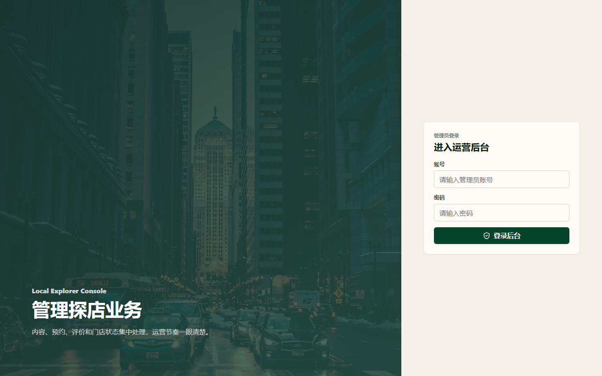 | 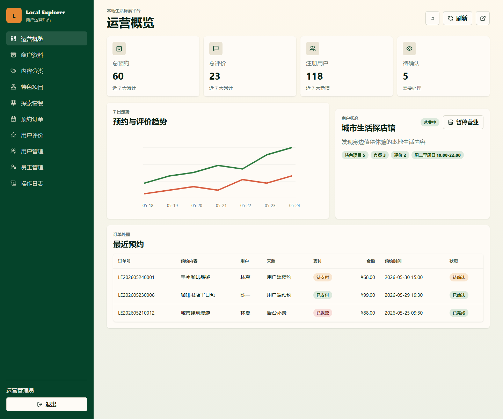 |

| 探店套餐管理 | 用户端发现页 |
| --- | --- |
| 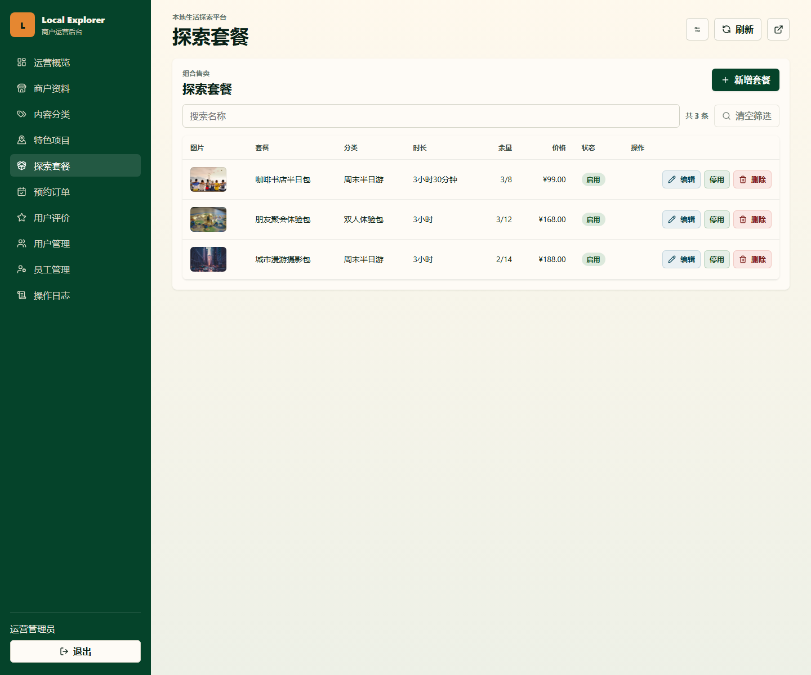 | 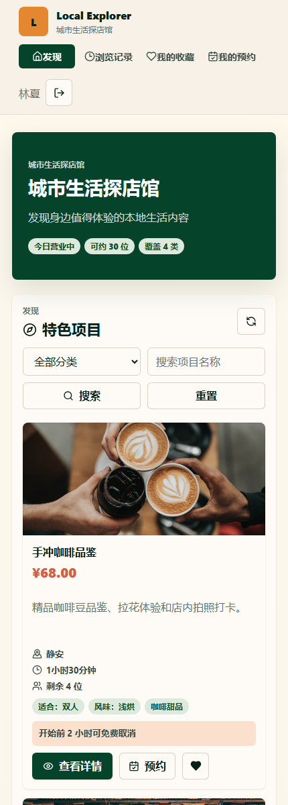 |

| 用户端登录 | 用户端我的预约 |
| --- | --- |
| 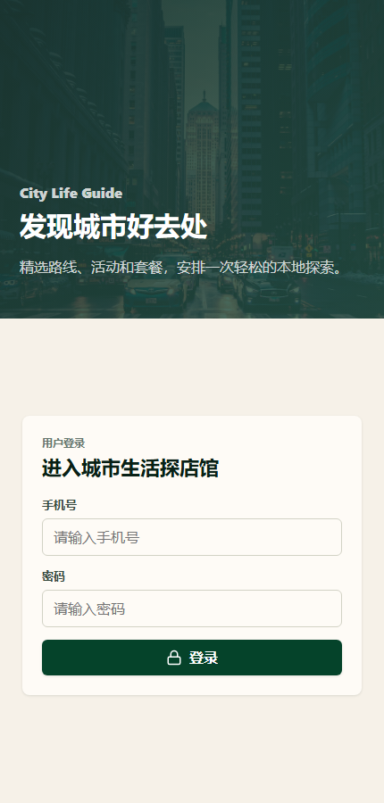 | 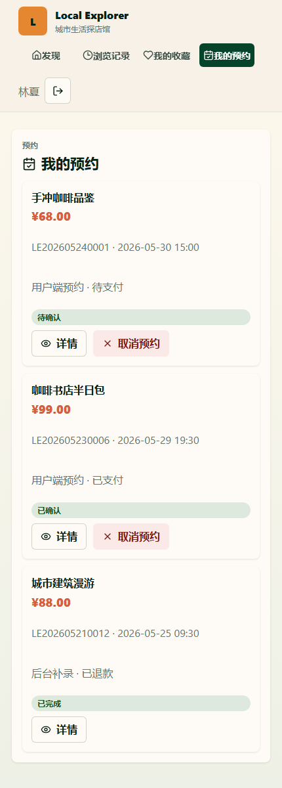 |

| 通知中心桌面端 | 通知中心移动端 |
| --- | --- |
| 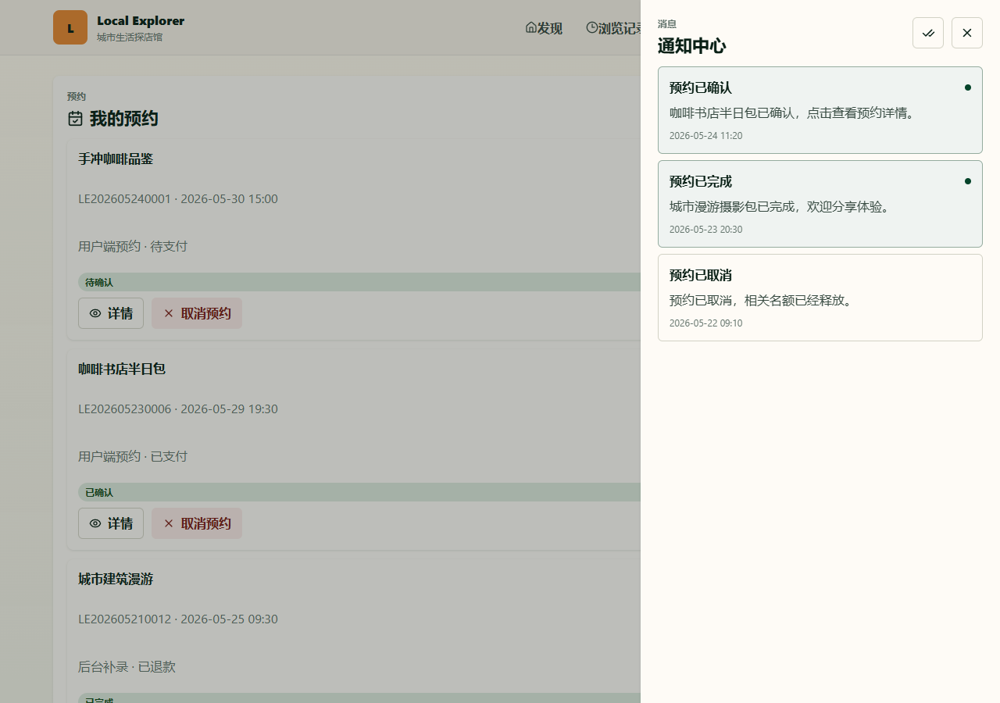 | 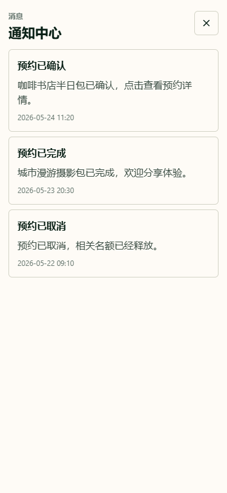 |

| 导出任务桌面端 | 导出任务移动端 |
| --- | --- |
| 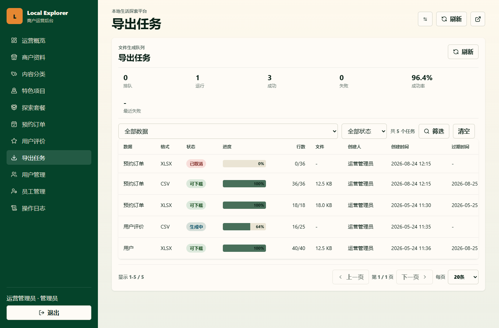 | 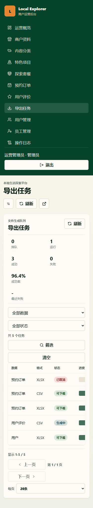 |

截图通过本地静态页的 `?demo=1` 模式生成，便于在未启动数据库和后端时快速复现。可用以下脚本重新生成截图：

```powershell
powershell -NoProfile -ExecutionPolicy Bypass -File scripts\capture-demo-screenshots.ps1
```

## 参考

> 本地生活探店与商家管理平台：基于Spring Boot、MyBatis、MySQL、Redis、Caffeine、React和Vite实现的双端Web业务系统。公共浏览通过两级缓存、single-flight、带续租分布式锁和事务提交后失效处理热点与跨实例一致性；预约模块使用requestId唯一键、数据库CAS、ShedLock和事务Outbox完成幂等、防超卖、超时关闭、失败重试和通知最终一致；Testcontainers、MockMvc、Playwright和真实性能smoke共同验证事务、并发、故障恢复、接口与前端闭环。
