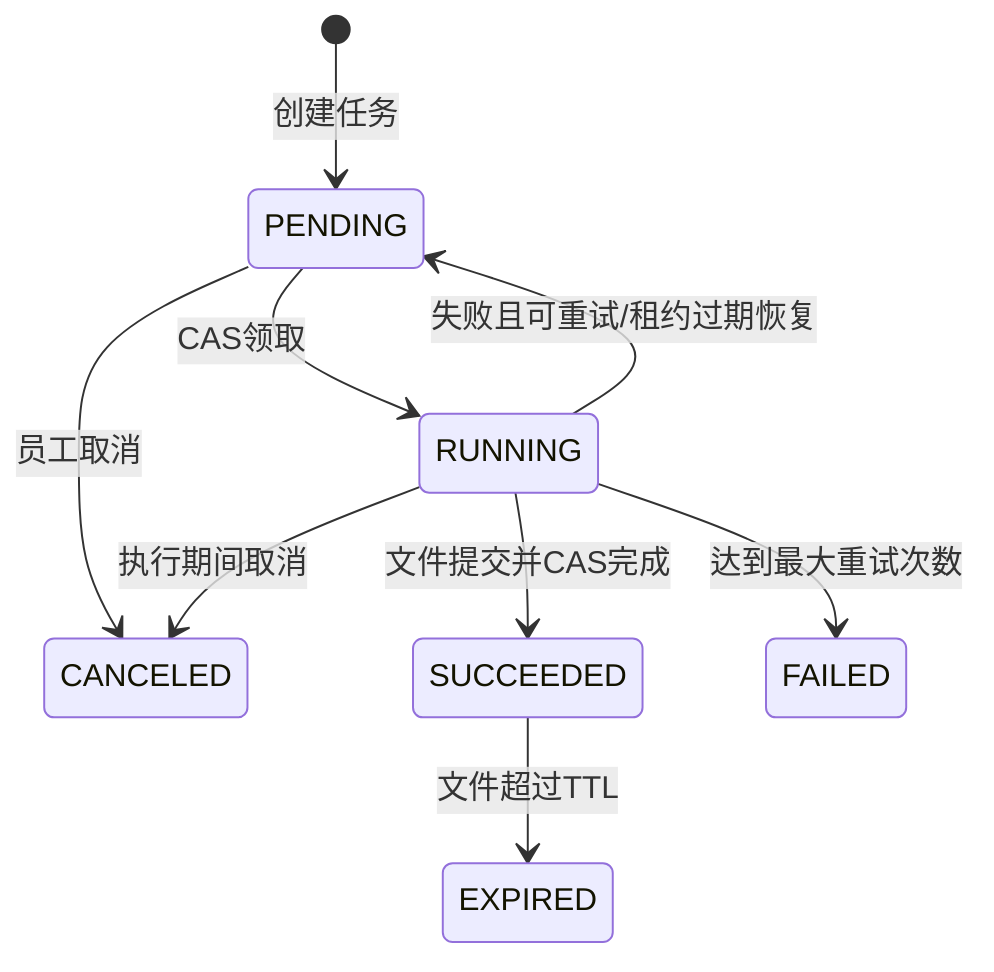
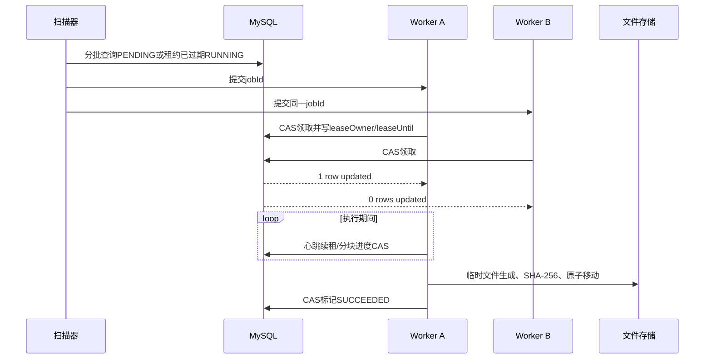

# 异步导出与任务调度中心

## 目标和边界

订单、用户、评价和操作日志不再由HTTP请求同步拼接CSV。接口只冻结查询条件并创建任务，后台执行器负责领取、流式生成、校验和提交文件，React任务中心负责查看进度、取消、重试和下载。

当前实现只依赖MySQL、本地文件系统、Spring Scheduling、ShedLock和Apache POI SXSSF。文件存储通过`ExportFileStorage`抽象，可在不改业务状态机的情况下扩展到对象存储；当前不引入MQ、MinIO或额外任务平台。

## 组成

| 组件 | 职责 |
|---|---|
| `ExportJobServiceImpl` | 幂等创建、权限和资源限制、列表、详情、取消、重试、下载校验 |
| `ExportSnapshotService` | 冻结筛选、列、排序、时间范围和最大主键边界 |
| `ExportSnapshotCipher` | 使用AES-GCM加密姓名、联系人和手机号筛选值后再持久化 |
| `ExportJobDispatchTask` | 小批量扫描可执行任务并提交到有界线程池 |
| `ExportJobTransactionService` | 以独立事务完成CAS领取、续租、进度、成功和失败状态更新 |
| `ExportJobProcessor` | 协调租约心跳、生成、原子提交、校验、失败重试和临时文件回收 |
| `ExportFileGenerator` | keyset分块读取并流式生成CSV或XLSX |
| `LocalExportFileStorage` | 隔离临时区与成品区、原子移动、SHA-256、路径边界和过期清理 |
| `ExportJobCleanupTask` | 过期任务状态转换、物理文件删除、临时文件和孤儿文件清理 |

## 状态机

状态转换集中在`ExportJobStatus`。数据库更新同时约束原状态和`lease_owner`，重复取消、重复完成、旧实例写进度或非法重试不会产生二次副作用，而是返回幂等结果或稳定冲突错误。

可编辑源图：[状态机](diagrams/async-export-state.drawio)和[领取时序](diagrams/async-export-claim-sequence.drawio)。

## 任务领取和租约恢复

ShedLock只保护扫描与清理批次，不包住整个文件生成过程。真正的多实例互斥由MySQL条件更新保证。Worker按`heartbeatSeconds`续租；进程崩溃后心跳停止，`lease_until`到期即可由其他实例重新领取。旧Worker即使恢复，也会因`lease_owner`不匹配而无法更新进度或完成任务。

调度器维护本实例正在排队的jobId集合，避免同一实例反复塞入线程池；线程数和队列容量均有上限。单任务异常在Worker边界被隔离，不影响同批其他任务。

## 查询快照

创建任务时冻结：

- 导出类型、格式、字段列表和`id ASC`排序；
- 时间范围及业务筛选条件；
- 创建时符合条件记录的`maxId`；
- 预计总行数和快照时间。

执行时使用`id > lastId AND id <= maxId ORDER BY id LIMIT batchSize`读取，不使用深分页OFFSET。任务不会包含创建后新增的数据；已有记录后续被修改时读取修改后的值，因此这是“创建时记录集合边界”，不是MySQL长事务一致性快照。

联系人、姓名和完整手机号筛选值使用AES-GCM加密后写入`query_snapshot`，执行时才在内存中解密。导出文件中的手机号统一脱敏为前三位、四个星号和后四位。

## 文件生命周期

1. Worker在配置目录的`tmp`子目录创建`.part`临时文件。
2. CSV逐行写入UTF-8 BOM文件；XLSX使用SXSSF窗口流式落盘并压缩临时文件。
3. 每个分块检查取消、租约、执行时间和文件大小，并更新进度。
4. 生成结束后关闭流、计算SHA-256，再原子移动到`files`成品目录。
5. 只有原子移动和校验完成后，任务才通过CAS进入`SUCCEEDED`。
6. 下载前重新检查状态、TTL、物理文件、大小和SHA-256。
7. 超过`fileTtlHours`后任务进入`EXPIRED`；文件删除成功后清空数据库路径。删除失败保留引用，下批继续重试。
8. 清理任务额外回收超时`.part`文件和无数据库引用的孤儿成品。

XLSX文本限制为32767字符，非法XML控制字符会被移除。CSV和XLSX均对去除前导空白后以`= + - @`开头的文本增加单引号，避免公式注入。

## 权限与下载安全

- ADMIN可查看全部任务、创建四种导出、重试失败任务并查看统计。
- STAFF可创建订单和评价导出，只能查看、取消、重试和下载自己的非敏感任务。
- 用户和操作日志导出仅ADMIN可创建。
- 下载每次重新执行认证、归属校验和文件完整性校验，jobId不可作为授权凭据。
- 服务端生成物理文件名；用户输入不会进入路径。
- 路径解析拒绝绝对路径、`..`、非法jobId和符号链接目录/文件，真实路径必须位于配置根目录内。
- `Content-Disposition`同时提供ASCII回退名和RFC 5987 UTF-8文件名，过滤CRLF和操作系统非法字符。
- 文件不包含密码、Token、身份证号、客户端指纹或完整手机号；异常日志不打印查询JSON和物理文件路径。

## 资源限制

| 配置 | 默认值 | 作用 |
|---|---:|---|
| `EXPORT_BATCH_SIZE` | 500 | 单次keyset读取行数 |
| `EXPORT_SCAN_BATCH_SIZE` | 10 | 每批扫描任务数 |
| `EXPORT_MAX_ATTEMPTS` | 4 | 最大执行次数 |
| `EXPORT_LEASE_SECONDS` | 60 | 数据库租约时长 |
| `EXPORT_HEARTBEAT_SECONDS` | 20 | 续租间隔 |
| `EXPORT_MAX_ACTIVE_PER_OPERATOR` | 3 | 单员工活跃任务数 |
| `EXPORT_MAX_RANGE_DAYS` | 366 | 最大查询时间范围 |
| `EXPORT_MAX_ROWS` | 100000 | 单任务最大行数 |
| `EXPORT_MAX_FILE_BYTES` | 52428800 | 单文件最大字节数 |
| `EXPORT_MAX_RUNTIME_SECONDS` | 900 | 单任务执行时间上限 |
| `EXPORT_FILE_TTL_HOURS` | 24 | 成品保留时间 |
| `EXPORT_WORKER_THREADS` | 2 | Worker线程数 |
| `EXPORT_WORKER_QUEUE_CAPACITY` | 20 | 有界等待队列容量 |
| `EXPORT_SNAPSHOT_SECRET` | 仅开发默认值 | 查询快照PII加密密钥，部署时必须替换 |

临时I/O等可恢复故障采用有上限指数退避，达到最大次数进入`FAILED`。文件超过上限和执行超时分别记录`EXPORT_FILE_TOO_LARGE`、`EXPORT_RUNTIME_EXCEEDED`，这类永久资源错误立即进入`FAILED`且不做无意义重试。所有错误信息都会截断并清理敏感内容。

## 可观测性

Micrometer指标覆盖：

- `local.explorer.export.result`：创建、幂等、领取、恢复、成功、失败、取消、重试、过期和清理失败；
- `local.explorer.export.queue.delay`、`local.explorer.export.execution`；
- `local.explorer.export.rows`、`local.explorer.export.rows.per.second`、`local.explorer.export.file.bytes`；
- `local.explorer.export.retry.count`；
- `local.explorer.export.pending`、`running`、`failed`积压Gauge。

标签仅使用`export_type`、`format`、`result`等有限枚举，禁止把jobId或operatorId作为标签。日志使用jobId、batchId、operatorId、processedRows、result和elapsedMs定位单次执行，但不记录文件绝对路径或完整查询条件。

`ExportJobHealthIndicator`在存在FAILED或过期租约时返回`DEGRADED`，仍映射HTTP 200；少量业务失败不会让整个服务判定DOWN。`GET /admin/export-jobs/stats`仅ADMIN可访问，返回各状态数量、过期租约、成功率和最近失败摘要。

## 测试证据

- 单测：完整状态转换矩阵、幂等竞争、权限、取消/重试、续租丢失、退避、资源上限、生成中取消后的临时文件回收、清理重试、公式注入、非法字符和路径边界。
- Testcontainers MySQL：唯一约束、外键、四组EXPLAIN索引、双线程CAS领取、过期租约恢复、双Processor只生成一个文件、加密PII快照和真实文件校验。
- 真实10000行MySQL导出：CSV和XLSX均解析行数、表头、SHA-256、文件大小和吞吐。
- 100000行生成器测试：CSV和SXSSF XLSX按201个分块读取，每批不超过500行，并采样GC后留存堆增量，输出性能JSON和样例文件。
- Playwright：真实后端走通创建、等待、下载、取消、文件超限失败、手动重试和离开页面停止轮询；Demo故障场景验证失败与重试；桌面和移动端检查无横向溢出。

真实数据库行为由`ExportJobMySqlIT`验证，大文件流式边界由`ExportFileGeneratorPerformanceIT`验证。证据文件位于`explorer-web/target/export-performance/`，CI上传Surefire、Failsafe、JaCoCo、性能JSON和代表性CSV/XLSX。

## 扩展到对象存储

保持`ExportFileStorage`接口不变即可新增对象存储实现：临时对象上传完成后执行服务端复制或完成分片上传，保存对象Key、ETag/SHA-256和大小；下载仍先鉴权，再生成短时签名URL。数据库任务状态机、租约、重试、权限和前端任务中心无需改写。若任务量增长到单库扫描成为瓶颈，可将“任务已创建”事件投递MQ，但数据库CAS和幂等键仍保留为最终一致性防线。

## 已知边界

- 当前快照冻结记录集合，不冻结每行值；严格历史快照需要版本表或独立快照库。
- 本地文件系统适合单机和共享盘部署；多机本地盘部署需要对象存储。
- 执行时间在分块和文件写入边界检查，数据库单条查询还受JDBC/MySQL超时配置约束。
- 当前只有应用内指标与健康详情，未内置Grafana面板和外部告警路由。
