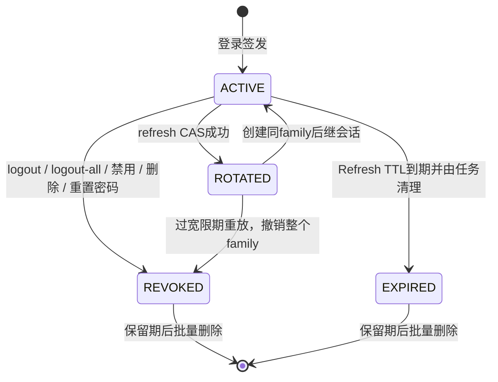

# 双端认证与会话安全

本文说明管理端和用户端如何在保留现有MD5密码数据的前提下，实现短期Access Token、轮换Refresh Token、服务端会话、即时撤销、登录防爆破和前端自动续期。MD5只用于兼容历史演示账号，不代表推荐的生产密码方案。

## 威胁模型

| 风险 | 处理 |
| --- | --- |
| Access Token泄露后长期可用 | Access Token默认30分钟，并绑定服务端`session_id` |
| Refresh Token被数据库泄露 | 只保存SHA-256摘要，明文仅存在HttpOnly Cookie |
| Refresh Token被重复使用 | 单次轮换，过宽限期后重放会撤销整个token family |
| 两个请求同时刷新 | 数据库CAS只允许一个请求消费旧会话 |
| 退出后旧JWT继续访问 | 拦截器每次校验服务端会话和账号状态 |
| 用户Token访问后台 | 独立secret、Header、`principalType`和拦截器 |
| 暴力猜测账号密码 | 账号摘要和IP摘要组合计数，5次失败后锁定15分钟 |
| 伪造代理IP绕过锁定 | 默认只使用连接IP，显式启用可信代理后才读取`X-Forwarded-For` |
| 跨站触发refresh/logout | 同源或允许列表Origin校验，Cookie使用`SameSite=Lax` |
| 日志泄露身份凭证 | 不记录密码、JWT、Cookie、Refresh Token、完整手机号和完整IP |

## 双端边界

| 端 | Access Header | Refresh Cookie | Cookie Path | JWT secret |
| --- | --- | --- | --- | --- |
| 管理端 | `token` | `LX_ADMIN_REFRESH` | `/admin` | `JWT_ADMIN_SECRET` |
| 用户端 | `authentication` | `LX_USER_REFRESH` | `/user` | `JWT_USER_SECRET` |

Access JWT必须同时包含`sessionId`、`tokenType=ACCESS`、`principalType`、`jti`、`iat`和`exp`。拦截器除验签外，还校验端类型、会话为ACTIVE、会话身份匹配以及账号仍存在且启用。旧版不含这些claims的JWT会被拒绝，升级后需要重新登录一次。

## Token生命周期



Access Token默认30分钟，Refresh Token默认7天。刷新时旧Refresh Token不会再次有效，新Token通过响应的`Set-Cookie`返回，接口JSON只返回新的Access Token和账号展示信息。

## 刷新轮换与并发

刷新核心过程位于同一MySQL事务：

```text
SHA-256(raw Refresh Token)
  -> 查询auth_session
  -> UPDATE ... SET status='ROTATED' WHERE session_id=? AND status='ACTIVE'
  -> 影响1行：插入同token_family_id的新ACTIVE会话并提交
  -> 影响0行：并发失败，返回统一401
```

CAS保证两个线程同时刷新时只有一个后继会话。若新会话插入失败，事务回滚，旧会话仍是ACTIVE，不会出现“旧Token失效、新Token又没创建”的半完成状态。

浏览器可能在同一瞬间发出多个401请求，因此系统默认设置2秒`AUTH_REPLAY_GRACE_MILLIS`：在旧Token刚被轮换后的宽限期内再次出现，只返回401，不撤销赢家；超过宽限期再出现则判定为重放，撤销整个token family。宽限期只解决并发观察，不让旧Token获得第二次刷新成功。

## 服务端撤销

- `logout`按Refresh Token摘要撤销当前会话，并清空当前端Cookie。
- `logout-all`撤销该身份的全部ACTIVE会话。
- 员工/用户禁用、删除或密码重置与`revokeAll`在同一业务事务内执行。
- Access Token每次请求都查询`auth_session`，所以服务端撤销后立即返回HTTP 401/code 40100，不等待JWT自然过期。

Refresh Token过期、摘要不存在、端类型不匹配、会话撤销和并发CAS失败对外统一为“刷新凭证无效或已失效”，避免泄露会话状态细节。

## 登录保护

`login_guard`以`(principal_type, account_hash, ip_hash)`建立唯一键。失败计数使用单条`INSERT ... ON DUPLICATE KEY UPDATE`原子递增，避免多个首次失败请求采用“先插入再加锁”造成死锁或丢计数。

默认规则：

- 10分钟窗口内连续失败5次。
- 第6次及锁定期间请求返回HTTP 429/code 42900。
- 锁定15分钟，成功登录清除对应失败状态。
- 账号不存在和密码错误统一返回“账号或密码错误”。
- ADMIN可分页查看当前锁定并解除锁定，普通STAFF不能访问。

数据库只保存带盐SHA-256账号/IP摘要和脱敏`account_hint`。业务`user.phone`仍是账号字段，本限制针对认证会话、登录保护和日志，不改变既有业务表。

## Cookie、Origin和代理

Refresh Cookie设置`HttpOnly; SameSite=Lax`和端级Path。dev默认允许HTTP调试，prod配置默认`Secure=true`。生产环境应只通过HTTPS同源部署，不要关闭Secure。

浏览器携带Origin时，登录、refresh和logout只接受当前服务同源或`AUTH_ALLOWED_ORIGINS`明确列出的来源。无Origin请求保留给服务间调用和本地smoke。当前前端默认同源；Vite开发服务器通过代理访问8080，因此不需要开放宽泛CORS。

`AUTH_TRUSTED_PROXY_ENABLED=false`时忽略所有转发IP头。只有部署在受控Nginx之后才应启用，并由代理覆盖客户端传入的`X-Forwarded-For`。

## 前端续期

Access Token只保存在`sessionStorage`，Refresh Token由浏览器Cookie管理，JavaScript无法读取。统一请求客户端实现：

1. 普通请求返回401后，按admin/client作用域进入single-flight刷新。
2. 同一端多个401只发出一次refresh，双端互不共享刷新任务。
3. 刷新成功后，每个原请求最多重试一次；再次401直接回登录页。
4. 页面刷新且内存中没有Access Token时，通过Refresh Cookie恢复会话。
5. 退出先调用后端撤销，再清理`sessionStorage`和旧版本遗留的localStorage Token。

## 清理与可观测性

`AuthSessionCleanupJob`使用Spring Scheduling和ShedLock，每批先把到期ACTIVE会话标记EXPIRED，再删除超过保留期的ROTATED/REVOKED/EXPIRED记录。测试环境关闭全部定时任务。

认证日志依赖MDC中的`requestId`，只记录`principalType`、截断sessionId、固定结果和耗时。操作日志中的`clientIp`列保存16位带盐IP指纹，不保存原始IP。指标只使用低基数标签：

- `local.explorer.auth.login{principal_type,result}`
- `local.explorer.auth.refresh{principal_type,result}`
- `local.explorer.auth.revoked{principal_type}`
- `local.explorer.auth.login.latency`
- `local.explorer.auth.refresh.latency`
- `local.explorer.auth.cleanup`

ADMIN可访问`GET /admin/auth-security/sessions/stats`和锁定运维接口。

## 验证证据

```powershell
.\mvnw.cmd test
.\mvnw.cmd verify -Pintegration-test
node --test explorer-web\src\test\js\*.test.cjs
powershell -NoProfile -ExecutionPolicy Bypass -File scripts\smoke-auth-session.ps1
Set-Location explorer-web\frontend
npm run smoke:auth
```

`AuthSessionMySqlIT`使用真实MySQL验证摘要唯一键、两线程CAS、只有一个ACTIVE后继、过宽限期重放撤销family，以及新会话插入失败时旧Token仍可用。`smoke-auth-session`验证登录、轮换、重放、logout、logout-all、429锁定和ADMIN解锁；Playwright验证双端页面刷新恢复、伪造过期Access自动续期及退出后不可恢复。

## 演进路径

当前服务端会话以MySQL为准，适合单体和中小流量。访问量上升后可把ACTIVE会话状态以短TTL缓存到Redis，撤销时删除缓存并以MySQL作为最终依据；Refresh轮换和登录保护仍保留数据库CAS/唯一键，避免把一致性完全交给缓存。密码方案是明确安全债务，生产化下一步应使用BCrypt或Argon2并在成功登录时渐进升级历史MD5摘要。

## 面试讲法

> 我没有把JWT当成永远有效的无状态票据。Access Token短期有效并绑定MySQL会话，Refresh Token是HttpOnly随机值且数据库只存摘要。刷新通过CAS单次消费，事务失败可回滚；并发宽限后发现旧Token重放会撤销整个令牌族。账号禁用、退出和重置密码都能立即撤销会话。登录失败用唯一键原子upsert计数，真实MySQL测试证明并发刷新只有一个后继，浏览器测试证明续期与退出闭环。
