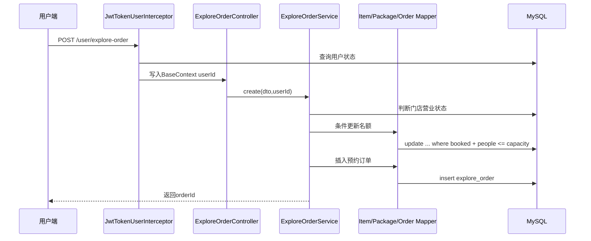

# 后端工程设计说明

这份文档用于说明项目的后端设计重点。面试时不要只讲“我做了增删改查”，要讲清楚后端如何划分边界、保护数据、处理异常、支撑真实业务流程。

## 后端定位

项目后端不是给前端页面临时拼接口，而是围绕本地生活探店业务做了完整链路：

- 用户端负责登录、浏览项目、收藏、浏览记录、预约和评价。
- 管理端负责员工登录、分类、项目、套餐、订单、评价、用户、员工和商户配置管理。
- 数据层使用MySQL保存核心业务数据，Redis承担缓存和用户行为记录。
- 横切能力通过拦截器、AOP和统一异常处理收口。

对应模块：

```text
explorer-common  通用常量、异常、返回结构、JWT工具、配置属性
explorer-model   DTO、Entity、VO
explorer-web     Controller、Service、Mapper、AOP、拦截器、前端静态资源
```

## 请求边界

后端把管理端和用户端拆成两套入口：

| 入口 | 前缀 | 身份 | token header |
| --- | --- | --- | --- |
| 管理端 | `/admin/**` | 员工 | `token` |
| 用户端 | `/user/**` | 用户 | `authentication` |

`WebMvcConfiguration`注册两个JWT拦截器。管理端拦截器只处理员工身份，用户端拦截器只处理用户身份。两个拦截器使用不同secret、Header、`principalType`和Refresh Cookie Path，避免用户Token访问后台接口，也避免员工Token被用户端误认。管理端认证通过后，再由`AdminAuthorizationInterceptor`处理`@RequireAdmin`权限点。

拦截器验签后还会校验Access Token的`sessionId/tokenType/principalType/jti/iat/exp`，并查询服务端会话和账号状态：

- 员工或用户不存在，返回401。
- 员工或用户被禁用，旧token立即失效。
- 会话已轮换、撤销或过期，旧Access Token立即失效。
- 请求完成后清理`BaseContext`，避免线程复用时串身份。

相关文件：

- `explorer-web/src/main/java/com/localexplorer/config/WebMvcConfiguration.java`
- `explorer-web/src/main/java/com/localexplorer/interceptor/JwtTokenAdminInterceptor.java`
- `explorer-web/src/main/java/com/localexplorer/interceptor/JwtTokenUserInterceptor.java`
- `explorer-web/src/main/java/com/localexplorer/interceptor/AdminAuthorizationInterceptor.java`
- `explorer-web/src/test/java/com/localexplorer/interceptor/JwtTokenInterceptorTest.java`
- `explorer-web/src/test/java/com/localexplorer/interceptor/AdminAuthorizationInterceptorTest.java`

## 业务分层

项目采用常见Spring Boot分层，但每层职责明确：

| 层 | 职责 |
| --- | --- |
| Controller | 接收请求、参数校验、读取当前身份、返回统一`Result` |
| Service | 业务规则、状态流转、事务边界、缓存失效 |
| Mapper | MyBatis查询、条件更新、分页查询 |
| DTO/VO | 入参和出参隔离，避免直接暴露数据库对象 |

典型链路：用户创建预约。



## 后端核心能力

### 认证和会话撤销

JWT不是只做签名校验。Access Token默认30分钟并绑定MySQL`auth_session`；Refresh Token由`SecureRandom`生成，只以SHA-256摘要落库并放入HttpOnly Cookie。每次refresh用数据库CAS把旧会话从ACTIVE改为ROTATED，再在同一事务创建后继会话；并发刷新只有一个赢家，插入失败会整体回滚。过并发宽限期再次观察到旧Token时，系统撤销整个token family。

`logout`撤销当前会话，`logout-all`撤销账号全部会话。账号禁用、删除和密码重置也在业务事务中调用`revokeAll`。每次受保护请求都查询服务端会话与账号状态，因此无需等待JWT到期。前端把Access Token放在`sessionStorage`，Refresh Token对JavaScript不可见；多个401通过按端隔离的single-flight只触发一次刷新，每个请求最多重试一次。

登录保护使用`(principal_type, account_hash, ip_hash)`唯一键和单条MySQL upsert原子计数，默认10分钟5次失败后锁定15分钟。账号不存在和密码错误统一返回相同401，锁定期间返回HTTP 429/code 42900；ADMIN可查看和解除锁定。完整威胁模型和事务时序见`docs/AUTH_SESSION_SECURITY.md`。

验证：

- `JwtTokenInterceptorTest`
- `AuthSessionServiceImplTest`
- `AuthenticationServiceTest`
- `AuthSessionMySqlIT`
- `scripts/smoke-auth-session.ps1`

### RBAC权限边界

员工角色分为`ADMIN`和`STAFF`。内容、套餐、预约、评价、商户和营业状态属于日常运营，两个角色都可访问；员工管理、用户管理、操作日志、缓存和安全运维属于高风险能力，只允许`ADMIN`。异步导出再按任务归属和数据敏感级别授权：STAFF可管理自己的订单/评价任务，用户和操作日志导出仅ADMIN可创建。

权限由三层共同保证：

- 数据库`employee.role`保存角色，登录响应返回role。
- `AdminAuthorizationInterceptor`识别Controller上的`@RequireAdmin`并在身份认证后执行授权。
- `AdminPermissionService`在员工管理和重置密码等关键Service操作中再次校验，避免内部调用绕过Web层。

授权采用fail-closed：没有当前员工上下文、员工不存在或角色不是ADMIN都返回HTTP 403/code 40300。前端隐藏无权入口只改善体验，不能代替后端鉴权。

验证：

- `AdminAuthorizationInterceptorTest`
- `EmployeeServiceImplTest`
- `UserServiceImplTest`
- `react-frontend.test.cjs`

### 预约容量一致性

预约创建不是先查再单独改库存，而是用SQL条件更新原子占用名额：

```sql
update explore_item
set booked = coalesce(booked, 0) + #{peopleCount}
where id = #{id}
  and status = 1
  and #{peopleCount} > 0
  and (capacity is null or coalesce(booked, 0) + #{peopleCount} <= capacity)
```

套餐使用同样模式。返回影响行数为0时，说明名额不足或状态变化，Service直接拒绝预约。

代码入口是`ExploreItemMapper#reserveCapacity`和`ExplorePackageMapper#reserveCapacity`。

验证：

- `ExploreOrderServiceImplTest`
- `scripts/smoke-critical-consistency.ps1`

### 预约幂等

创建预约支持可选`requestId`。同一用户重复提交相同requestId时先返回已存在订单；并发请求同时到达时，再由数据库唯一索引`(user_id, request_id)`裁决。后发请求命中唯一键后会释放本次已占名额并返回原订单id，避免重复订单和容量泄漏。

验证：

- `ExploreOrderServiceImplTest`
- `BookingApiFlowTest`

### 状态流转保护

预约状态只允许：

```text
待确认 -> 已确认 / 已取消 / 系统超时取消
已确认 -> 已完成 / 已取消
```

状态集中定义在`ExploreOrderStatus`，不在业务代码里散落魔法数字。业务更新使用`updateStatusIfCurrent`，系统超时使用同时检查`expire_at <= now`的`expireIfDue`。并发修改时，后来的请求会被拒绝或识别为已处理，避免重复释放名额。非法流转返回HTTP 409/code 40900。

### 超时关闭与分布式调度

新预约由可注入`Clock`计算`expireAt`。`OrderExpirationJob`按小批量扫描到期的待确认订单，ShedLock JDBC使用数据库时间避免多个实例同时调度；每个订单再交给`ExpiredOrderProcessor`以`REQUIRES_NEW`独立事务处理。

单笔事务内依次执行到期CAS、释放容量、写取消原因和追加Outbox。任一步失败全部回滚，一条失败不会阻塞同批后续订单。ShedLock降低重复扫描，CAS保证最终并发正确性；进程中断后未提交事务回滚，重启后继续扫描。

验证：

- `ExpiredOrderProcessorTest`
- `OrderExpirationJobTest`
- `BookingMySqlIT`
- `scripts/smoke-order-reliability.ps1`

### 事务Outbox与最终一致性

确认、完成、用户取消和系统超时都会在订单事务中写入`order_event_outbox`，避免订单提交后通知事件丢失。Outbox处理器分批领取事件，使用`locked_until`控制租约、随机`lock_token`标识本次worker；完成、重试和DEAD更新必须同时匹配令牌。

通知插入和事件标记`PROCESSED`位于同一`REQUIRES_NEW`事务。旧worker租约失效后，即使先尝试写通知，也会因令牌CAS失败而整体回滚。失败按有上限的指数退避重试，最终进入`DEAD`；ADMIN可以分页查看、统计和手动重试。

`user_notification.event_id`有唯一约束，事件重复投递不会产生重复通知。payload只保存订单id、编号、项目名、状态和取消信息，不保存密码、token或完整手机号。

完整状态图、时序图和MQ演进路径见`docs/ORDER_RELIABILITY.md`。

### 缓存和主动失效

分类、项目、套餐、商户资料和营业状态使用`Caffeine L1 -> Redis L2 -> MySQL`三级读取链路。L1有最大容量和20秒新鲜周期，L2默认10分钟并带随机抖动；空结果使用30秒短缓存。缓存Key包含domain、schema版本、命名空间版本和业务Key摘要。

同实例冷Key由single-flight合并，多实例由带owner、租约、Lua安全释放和watchdog续租的Redis锁协调。等待和网络访问都有上限；Redis故障时短时熔断到L1/MySQL，恢复后自动清理本地旧值并回填L2。缓存JSON损坏或绝对期限到期会删除并回源。

所有写后失效由`CacheInvalidationCoordinator`注册`afterCommit`回调：事务回滚不删缓存；列表通过命名空间递增批量失效，详情精确删除，并用Redis Pub/Sub清理其他实例L1。消息丢失时，其他实例旧值最多保留一个L1新鲜周期。完整设计见`docs/CACHE_HOT_PATH.md`。

### 用户行为记录

浏览记录和收藏使用Redis ZSet：

```text
key: user:{userId}:browse / user:{userId}:favorite
member: itemId
score: 毫秒时间戳
```

这样可以天然支持去重、倒序分页、计数和收藏状态判断。Redis不可用时，用户行为临时降级到JVM内存，保证演示和本地运行不断。

### 操作审计

后台写操作使用`@OperationLog`记录操作人、请求路径、请求方法、带盐IP指纹、耗时和中文描述，不保存完整IP。切面只在业务返回成功时记录；失败写操作不会被伪记成成功。

日志写入使用异步线程池，失败只写警告，不影响主业务。

验证：

- `OperationLogAspectTest`
- `operation-log-contract.test.cjs`
- `scripts/smoke-admin-management.ps1`

### 导出安全

导出已从HTTP同步CSV升级为数据库任务中心。任务以`requestId`唯一键防重复创建，通过MySQL CAS租约在多实例间互斥领取，心跳续租；崩溃后的RUNNING任务在租约过期后可恢复。每批数据使用主键游标读取，CSV逐行写入，XLSX使用SXSSF，文件先写`.part`再原子移动，完成状态只在大小和SHA-256校验后提交。

文本单元格如果去掉前导空白后的首字符是`= + - @`，会自动前置单引号；手机号在文件内脱敏，PII查询筛选使用AES-GCM密文落库。下载重新检查身份、任务归属、TTL、真实路径、大小和校验值，拒绝路径穿越和符号链接逃逸。

验证：

- `ExportJobStatusTest`、`ExportJobServiceImplTest`、`ExportJobProcessorTest`
- `ExportFileGeneratorTest`、`LocalExportFileStorageTest`、`ExportJobCleanupTaskTest`
- `ExportJobMySqlIT`、`ExportFileGeneratorPerformanceIT`
- `react-frontend.test.cjs`

状态图、领取时序、资源上限和对象存储演进见`docs/ASYNC_EXPORT.md`。

### 稳定错误语义

`ErrorCode`统一维护业务code、HTTP状态和默认消息。`GlobalExceptionHandler`把参数错误、认证失败、权限不足、业务冲突、唯一约束、系统异常和数据库未初始化分别映射为400/401/403/409/500/503。未知异常和数据库约束异常只在服务端记录详情，响应体不返回SQL、堆栈或连接信息。

验证：

- `GlobalExceptionHandlerTest`
- `JwtTokenInterceptorTest`
- `AdminAuthorizationInterceptorTest`

### 健康检查和降级状态

Spring Boot Actuator开放`/actuator/health`。MySQL使用Actuator数据源健康组件；`RedisFallbackHealthIndicator`在两级缓存正常时返回`UP`和`two-level`，Redis不可用时返回`DEGRADED`和`l1-mysql-fallback`，并展示L1条目、熔断和待重试失效数量。健康响应隐藏连接详情，Redis降级仍返回HTTP 200，MySQL不可用则整体为`DOWN`。

Outbox存在DEAD事件时也返回`DEGRADED`而非`DOWN`，少量通知失败不会把核心服务摘除；ADMIN统计接口提供具体积压数量。

验证：

- `RedisFallbackHealthIndicatorTest`
- `backend-build-config.test.cjs`

### 真实数据库验证

默认单测用Mock快速验证业务分支，`integration-test` Profile再使用Testcontainers启动MySQL 8和Redis 7。`BookingMySqlIT`验证预约与Outbox可靠性；`AuthSessionMySqlIT`验证Refresh摘要唯一、并发CAS和重放撤销；`HotCacheMySqlRedisIT`启动两个Spring应用上下文，验证真实L2、分布式锁、跨实例失效、坏值、Redis暂停和恢复。容器结束即销毁，不污染本机环境。

验证：

- `BookingMySqlIT`
- `AuthSessionMySqlIT`
- `HotCacheMySqlRedisIT`
- `docs/INTEGRATION_TESTING.md`

### 请求链路和指标

`RequestTracingFilter`透传或生成`X-Request-Id`，写入MDC、响应头和异常响应，并记录方法、路径、状态与耗时。认证日志只记录身份类型、截断sessionId、结果和耗时；超时和Outbox任务每批生成`batchId`。缓存日志只记录Key摘要、domain、layer、result和耗时。Micrometer使用固定枚举标签记录认证、预约、可靠事件以及L1/L2/DB访问、锁竞争、Redis降级和失效；Actuator自动提供HTTP耗时与异常标签。Prometheus只在dev/test开放，prod默认只暴露健康检查。

验证：

- `RequestTracingFilterTest`
- `BookingMetricsTest`
- `BookingMySqlIT`
- `docs/OBSERVABILITY.md`

## 可以主动承认的取舍

- 密码摘要目前保留MD5，适合本地演示和历史数据兼容；生产环境应换BCrypt或Argon2，并加入密码升级策略。
- Redis行为记录在降级到JVM内存后不具备跨进程持久性；正式环境应保证Redis可用，或增加异步落库。
- 公共浏览缓存保证最终一致而非强一致；Pub/Sub消息丢失时其他实例可能在一个L1新鲜周期内读到旧值。
- 当前项目以单体应用为主，适合实习项目展示；如果要继续演进，可以拆分订单、内容、用户行为和运营统计模块。

## 面试讲法

可以这样总结：

> 我围绕真实业务风险补了双端认证、ADMIN/STAFF授权、会话撤销、预约状态机和容量并发控制。订单超时使用ShedLock调度、到期CAS和逐单事务，状态、容量与Outbox同事务；Outbox再通过带令牌的租约、指数退避、DEAD运维和通知唯一键实现最终一致。MockMvc验证权限和错误语义，Testcontainers用真实MySQL证明并发、事务、索引和约束，日志、指标与健康状态形成定位闭环。
