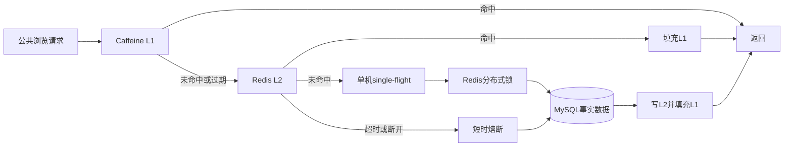
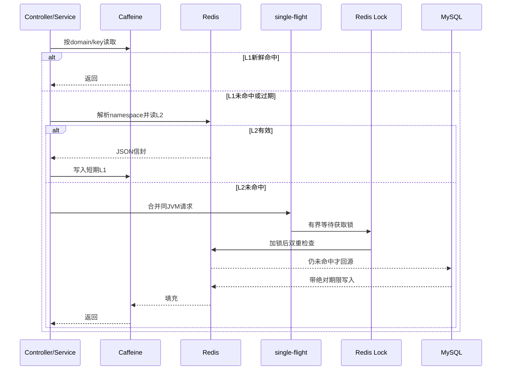
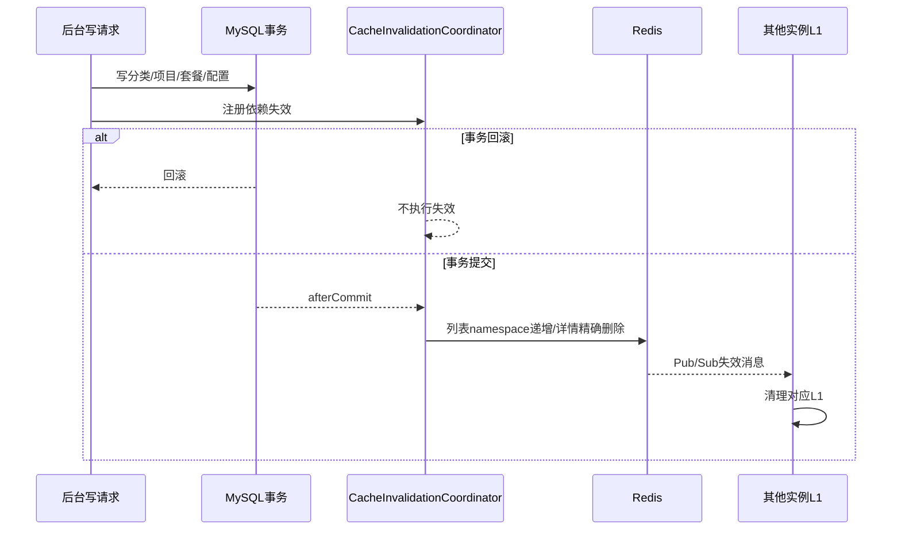

# 公共浏览热路径设计

## 目标与范围

本设计只缓存公共、读多写少的数据：分类列表、项目列表/详情、套餐列表/详情/关联项目、商户资料和营业状态。用户订单、通知、收藏及浏览历史不进入公共缓存，避免跨用户数据污染。

MySQL是唯一事实来源。缓存只优化读取，不参与业务状态判定，也不能绕过数据库事务与约束。

## 架构



## 缓存域

| domain | 业务Key示例 | 依赖失效 |
| --- | --- | --- |
| `category-list` | `type:1` | 分类写操作 |
| `item-list` | 规范化筛选条件 | 项目写操作、项目预约容量变化、分类变化 |
| `item-detail` | 项目id | 项目写操作、项目预约容量变化 |
| `package-list` | 规范化筛选条件 | 套餐写操作、项目/分类依赖变化 |
| `package-detail` | 套餐id | 套餐写操作、关联项目变化 |
| `package-items` | 套餐id | 套餐明细或关联项目变化 |
| `merchant-info` | `current` | 商户资料修改 |
| `shop-status` | `current` | 营业状态修改 |

## 读取时序



## Key与载荷

```text
数据Key: {prefix}:data:{domain}:s{schemaVersion}:n{namespaceVersion}:k{sha256前24位}
命名空间Key: {prefix}:namespace:{domain}
锁Key: {dataKey}:lock
通知频道: {prefix}:invalidate
```

业务Key只以SHA-256摘要进入Redis和日志。缓存载荷是JSON信封，包含`schemaVersion`、`cachedAt`、`freshUntil`、`l2FreshUntil`、`staleUntil`、空值标记和payload。结构版本不符、JSON损坏或绝对L2期限已过都会删除Key并回源；读取L2不会延长原始绝对期限。

## 时间边界

| 配置 | 默认值 | 语义 |
| --- | --- | --- |
| `HOT_CACHE_L1_TTL_MILLIS` | 20000 | L1新鲜周期，每次过期重新核对L2 |
| `HOT_CACHE_L2_TTL_MILLIS` | 600000 | L2绝对新鲜周期 |
| `HOT_CACHE_NULL_TTL_MILLIS` | 30000 | 空值L1/L2短期缓存 |
| `HOT_CACHE_STALE_TTL_MILLIS` | 120000 | L2期限后允许的有界旧值宽限 |
| `HOT_CACHE_TTL_JITTER_MILLIS` | 60000 | 正值TTL随机抖动上限 |

Caffeine使用最大容量和硬过期控制内存。L1“20秒”指新鲜周期，不代表旧值可以无限保留；只有Redis/MySQL同时异常且尚未超过绝对`staleUntil`时，才返回有界旧值。

## 热点保护

同一JVM使用`ConcurrentHashMap<String, CompletableFuture<?>>`实现single-flight。leader负责加载，followers在`HOT_CACHE_SINGLE_FLIGHT_WAIT_MILLIS`内复用结果；超时后直接回源，但不污染共享L2。

多实例通过`SET NX PX`竞争锁。锁值为随机owner，释放和续租使用Lua校验owner；watchdog每个租约三分之一周期续租。等待者短轮询L2，获得锁者必须再次检查L2。所有等待、Redis连接和命令都有明确超时。

这里没有抽象通用分布式锁框架，只实现缓存加载所需的owner、租约、续租和释放语义；业务规模扩大时可替换为Redisson，缓存Service接口无需变化。

## 写后失效时序



列表使用命名空间版本递增，不扫描未知Key；详情精确删除。重复失效是幂等操作。Redis暂时不可用时保留待重试失效，恢复任务补发。

## 一致性边界

- 数据库事务提交前不删除缓存，回滚不影响有效缓存。
- Pub/Sub正常时其他实例会立即清理L1。
- Pub/Sub消息丢失时，其他实例最多返回一个L1新鲜周期的旧值；L1过期后会从Redis解析新命名空间。
- Redis不可用期间，各实例无法实时交换失效消息；本实例立即失效，其他实例由L1新鲜周期限制旧值时间。
- 缓存不提供强一致读。要求强一致的订单状态、容量占用、权限和用户数据始终直接走MySQL事务。

## 降级与恢复

Redis异常会记录低基数指标并打开短时熔断，熔断期跳过Redis网络调用。L1新鲜命中继续服务；未命中回源MySQL。第一次Redis调用恢复成功时清空本地缓存，随后按新命名空间重新填充L2。

健康组件将此状态标记为`DEGRADED`和`l1-mysql-fallback`，HTTP仍为200；MySQL故障由独立数据库健康组件决定整体是否`DOWN`。

## 运维与指标

ADMIN接口：

```text
GET  /admin/cache/stats
POST /admin/cache/invalidate/{domain}
POST /admin/cache/warmup
```

Micrometer指标：

```text
local.explorer.cache.access{domain,layer,result}
local.explorer.cache.load.duration{domain,layer}
local.explorer.cache.lock.contention{domain}
local.explorer.cache.singleflight{domain,result}
local.explorer.cache.redis.degraded{domain}
local.explorer.cache.invalidation{domain,result}
local.explorer.cache.l1.entries
```

标签只使用固定domain、layer和result，不放userId、itemId或完整Key。访问日志记录requestId、业务域、层级、结果、耗时和Key摘要。

## 验证证据

- `HotReadCacheServiceTest`：L1/L2/DB、空值、旧结构、绝对TTL、旧值、100线程single-flight、锁超时不写L2、锁续租。
- `CacheInvalidationCoordinatorTest`：提交后失效和回滚不失效。
- `CacheOpsControllerTest`：ADMIN操作、STAFF 403和requestId。
- `HotCacheMySqlRedisIT`：两个Spring上下文、真实MySQL/Redis、分布式锁、跨实例失效、坏值、Redis暂停和恢复。
- `scripts/smoke-cache-performance.cjs`：冷态、热态和预热后各至少200次真实HTTP请求，输出p50/p95/p99、吞吐、命中率和MySQL回源次数。

## 扩展路径

单体扩展到更多实例时可以保持当前Key和失效协议，替换锁实现为Redisson并为Pub/Sub增加可靠失效事件。数据规模继续上升时，可把失效消息写入事务Outbox，再由Relay发送到Kafka/RabbitMQ；消费端仍按domain和namespace幂等清理L1，不改变MySQL事实来源。
