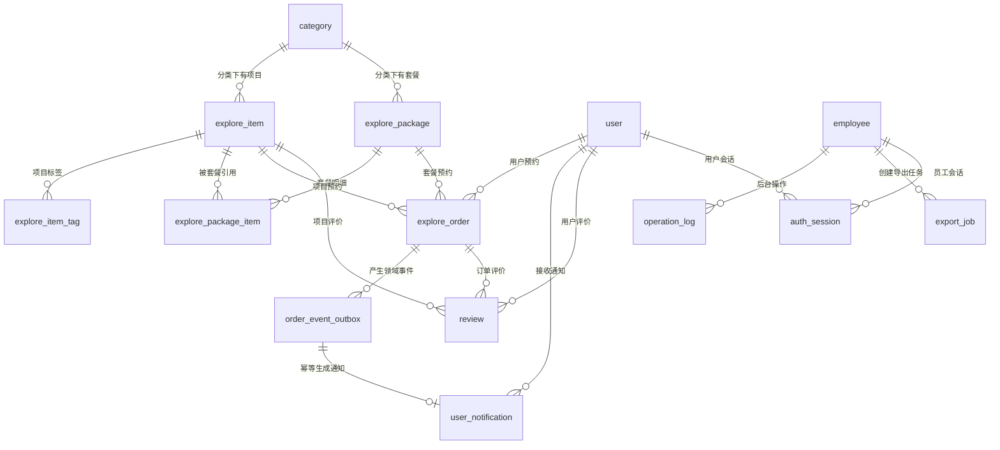

# 数据库设计说明

这份文档说明核心表关系、外键、索引、唯一约束、删除限制和状态流转。面试时不要只说“用了MySQL”，要说明哪些约束放在数据库，哪些规则放在Service。

## ER关系



## 核心表

| 表 | 作用 | 关键字段 |
| --- | --- | --- |
| `employee` | 后台员工账号 | `username`、`password`、`status`、`role` |
| `user` | 用户端账号 | `phone`、`password`、`status` |
| `auth_session` | 双端服务端会话 | `session_id`、`token_family_id`、`refresh_token_hash`、`status`、`expires_at` |
| `login_guard` | 登录失败窗口和锁定 | `principal_type`、`account_hash`、`ip_hash`、`failed_count`、`locked_until` |
| `category` | 项目和套餐分类 | `type`、`name`、`sort`、`status` |
| `explore_item` | 特色项目 | `category_id`、`price`、`capacity`、`booked`、`status` |
| `explore_package` | 探店套餐 | `category_id`、`price`、`capacity`、`booked`、`status` |
| `explore_package_item` | 套餐和项目关系 | `package_id`、`item_id`、`copies` |
| `explore_order` | 预约订单 | `user_id`、`order_no`、`request_id`、`status`、`expire_at`、`cancel_type` |
| `order_event_outbox` | 事务事件与失败重试 | `event_id`、`status`、`retry_count`、`lock_token`、`next_retry_at` |
| `user_notification` | 用户通知 | `event_id`、`user_id`、`order_id`、`read_status` |
| `shedlock` | 多实例调度锁 | `name`、`lock_until`、`locked_by` |
| `review` | 用户评价 | `user_id`、`item_id`、`order_id`、`rating`、`reply_content` |
| `operation_log` | 后台审计日志 | `operator_id`、`method`、`uri`、`description` |
| `export_job` | 异步导出任务、租约和文件元数据 | `job_id`、`request_id`、`status`、`lease_owner`、`file_path`、`checksum` |
| `runtime_setting` | 运行时配置 | `setting_key`、`setting_value` |

## 外键和删除限制

数据库层用外键兜住核心引用，Service层再给出更友好的业务提示。

| 约束 | 含义 | 删除策略 |
| --- | --- | --- |
| `fk_item_category` | 项目必须属于有效分类 | `ON DELETE RESTRICT` |
| `fk_package_category` | 套餐必须属于有效分类 | `ON DELETE RESTRICT` |
| `fk_item_tag_item` | 项目标签依赖项目 | `ON DELETE CASCADE` |
| `fk_package_item_package` | 套餐明细依赖套餐 | `ON DELETE CASCADE` |
| `fk_package_item_item` | 套餐明细引用项目 | `ON DELETE RESTRICT` |
| `fk_order_user` | 预约必须属于用户 | `ON DELETE RESTRICT` |
| `fk_order_item` | 项目预约引用项目 | `ON DELETE RESTRICT` |
| `fk_order_package` | 套餐预约引用套餐 | `ON DELETE RESTRICT` |
| `fk_outbox_order`、`fk_outbox_user` | 事件必须引用有效订单和用户 | `ON DELETE RESTRICT` |
| `fk_notification_event` | 通知必须来自有效事件 | `ON DELETE RESTRICT` |
| `fk_notification_user`、`fk_notification_order` | 通知必须属于有效用户和订单 | `ON DELETE RESTRICT` |
| `fk_review_user` | 评价必须属于用户 | `ON DELETE RESTRICT` |
| `fk_review_item` | 评价引用项目 | `ON DELETE RESTRICT` |
| `fk_review_order` | 评价引用订单 | `ON DELETE RESTRICT` |
| `fk_operation_log_employee` | 审计日志引用员工 | `ON DELETE RESTRICT` |
| `fk_export_operator` | 导出任务引用创建员工 | `ON DELETE RESTRICT` |

删除限制的原则：历史订单、评价、操作日志不能被后台误删破坏。已有历史引用的员工、项目、套餐优先改为禁用或停用。

## 索引和唯一约束

| 索引 | 表 | 作用 |
| --- | --- | --- |
| `idx_username` | `employee` | 保证后台账号唯一，支持登录查询 |
| `idx_user_phone` | `user` | 保证手机号唯一，支持用户登录 |
| `idx_category_name` | `category` | 避免重复分类名 |
| `idx_item_name` | `explore_item` | 避免重复项目名 |
| `idx_package_name` | `explore_package` | 避免重复套餐名 |
| `idx_order_no` | `explore_order` | 保证预约编号唯一 |
| `idx_order_user_request` | `explore_order` | 同一用户同一`request_id`只能创建一条预约，用于防重复提交 |
| `idx_user_id`、`idx_status` | `explore_order` | 支持我的预约、后台状态筛选 |
| `idx_order_status_expire` | `explore_order` | 按状态和到期时间分批扫描待关闭订单，真实MySQL `EXPLAIN`已验证命中 |
| `uk_outbox_event_id` | `order_event_outbox` | 领域事件ID唯一 |
| `idx_outbox_ready` | `order_event_outbox` | 按状态、下次重试时间和租约时间领取事件 |
| `uk_notification_event` | `user_notification` | 同一事件最多生成一条通知 |
| `idx_notification_user_read` | `user_notification` | 用户通知分页和未读数查询 |
| `uk_auth_session_id` | `auth_session` | Access JWT绑定的服务端session唯一 |
| `uk_auth_refresh_hash` | `auth_session` | Refresh Token摘要唯一，禁止同一凭证重复落库 |
| `idx_auth_principal` | `auth_session` | 按端类型和账号撤销全部活动会话 |
| `idx_auth_expiry` | `auth_session` | 批量标记到期会话 |
| `idx_auth_family` | `auth_session` | 重放时撤销整个token family |
| `uk_login_guard_tuple` | `login_guard` | 同一身份类型、账号摘要和IP摘要原子累计失败次数 |
| `idx_login_guard_locked` | `login_guard` | ADMIN分页查询当前锁定 |
| `idx_create_time` | `operation_log` | 支持按时间倒序查询审计日志 |

## 状态字段

| 表 | 字段 | 取值 |
| --- | --- | --- |
| `employee.status` | 员工状态 | `1`启用，`0`禁用 |
| `employee.role` | 员工角色 | `ADMIN`超级管理员，`STAFF`普通员工 |
| `user.status` | 用户状态 | `1`启用，`0`禁用 |
| `auth_session.status` | 会话状态 | `ACTIVE`、`ROTATED`、`REVOKED`、`EXPIRED` |
| `category.status` | 分类状态 | `1`启用，`0`禁用 |
| `explore_item.status` | 项目状态 | `1`上架，`0`停用 |
| `explore_package.status` | 套餐状态 | `1`上架，`0`停用 |
| `explore_order.status` | 预约状态 | `0`待确认，`1`已确认，`2`已完成，`3`用户/管理员取消，`4`系统超时取消 |
| `order_event_outbox.status` | 事件状态 | `PENDING`、`PROCESSING`、`PROCESSED`、`DEAD` |
| `user_notification.read_status` | 通知状态 | `0`未读，`1`已读 |

预约状态流转：

```text
待确认 -> 已确认 / 已取消 / 系统超时取消
已确认 -> 已完成 / 已取消
```

业务状态更新使用`updateStatusIfCurrent`；系统超时使用同时校验`expire_at <= now`的`expireIfDue`。两者都是数据库CAS，避免并发下重复确认、重复取消或重复释放名额。完整设计见`docs/ORDER_RELIABILITY.md`。

## RBAC权限控制

后台账号使用`employee.role`区分超级管理员和普通员工。JWT只保存员工id，接口进入Service后再按当前员工id查询数据库角色，避免旧token携带过期角色。

| 角色 | 权限边界 |
| --- | --- |
| `ADMIN` | 可以管理员工账号、用户账号和业务运营数据 |
| `STAFF` | 可以处理日常运营数据，但不能新增、编辑、删除、启停员工，也不能编辑、启停用户或重置用户密码 |

员工账号被禁用后，管理端拦截器会在每次请求时查询员工状态，旧token会立即失效。

## 认证数据边界

`auth_session`不对`principal_id`建立多态外键，因为同一字段可能指向`employee`或`user`；Service通过`principal_type`决定查询目标，拦截器再次核对会话身份和账号状态。该表不保存明文Refresh Token，只保存64位SHA-256摘要、带盐IP摘要和粗粒度设备摘要。

`login_guard`同样不保存完整账号或IP。唯一键配合`INSERT ... ON DUPLICATE KEY UPDATE`在一条SQL内完成窗口重置、失败累加和锁定时间设置，避免并发首次写入时死锁或丢计数。ADMIN接口只返回`account_hint`，不返回摘要字段。

会话轮换的ACTIVE到ROTATED CAS与后继会话插入位于同一事务。退出、禁用、删除、密码重置按`principal_type + principal_id`撤销ACTIVE会话。详细时序见`docs/AUTH_SESSION_SECURITY.md`。

## 幂等设计

`explore_order.request_id`由前端提交，同一用户同一`request_id`只允许生成一条预约：

```sql
UNIQUE KEY idx_order_user_request (user_id, request_id)
```

Service处理流程：

1. 如果`request_id`已存在，直接返回已有预约id。
2. 如果不存在，先原子占用名额，再插入预约。
3. 如果并发插入触发唯一约束，释放本次已占名额，再返回已有预约id。

这样可以同时处理重复点击、网络重试和并发提交。

## Outbox与通知幂等

订单状态变化和Outbox事件在同一事务提交，避免“订单已变但事件丢失”。事件处理器通过`locked_until + lock_token`领取：租约过期后新worker会写入新令牌，旧worker无法再把事件标记完成或覆盖重试状态。

通知写入和Outbox完成在同一独立事务中，`user_notification.event_id`唯一约束是最后一道幂等防线。即使任务重启或事件重复消费，用户也只看到一条通知。

## 异步导出任务

`export_job`保存任务状态、冻结查询、进度、租约、文件元数据、重试信息和操作者。文件本体不进入MySQL，数据库只保存服务端生成的相对路径、大小和SHA-256。

核心约束：

| 约束/索引 | 作用 |
| --- | --- |
| `PRIMARY KEY(job_id)` | 不可猜测的任务标识 |
| `uk_export_operator_request(operator_id, request_id)` | 同一员工重复请求只创建一个任务 |
| `fk_export_operator(operator_id)` | 保留任务审计归属，员工被引用时限制删除 |
| `idx_export_ready(status, next_retry_at, job_id)` | 小批量扫描PENDING和到期重试 |
| `idx_export_lease(status, lease_until, job_id)` | 扫描租约已过期的RUNNING任务 |
| `idx_export_operator_list(operator_id, create_time, job_id)` | STAFF按创建人倒序分页 |
| `idx_export_admin_list(create_time, job_id)` | ADMIN全量倒序分页 |
| `idx_export_expiration(status, expires_at)` | 扫描应过期成品 |
| `idx_export_failure(status, finished_at, job_id)` | 失败统计和最近失败查询 |

领取、续租、进度和完成更新都同时检查`status`及`lease_owner`。ShedLock只减少重复扫描，数据库CAS才是多实例并发正确性的最终边界。

初始化SQL和非破坏迁移SQL都定义相同字段、外键与索引；迁移脚本只在索引缺失或列顺序不兼容时重建。`ExportJobMySqlIT`通过MySQL 8 `EXPLAIN`实际验证领取、租约、STAFF列表和ADMIN列表分别命中预期索引。

查询快照中的姓名、联系人和手机号筛选使用AES-GCM密文保存，完整手机号只在执行内存中短暂恢复，导出文件统一脱敏。详见`docs/ASYNC_EXPORT.md`。

## 面试讲法

可以这样说：

> 数据库不是只建表存数据。我把唯一性、引用完整性和历史数据保护放在数据库层，比如员工账号、用户手机号、预约编号和预约幂等键都有唯一约束；订单、评价、操作日志通过外键限制删除。业务层再做友好错误提示和状态流转校验，避免数据库报错直接暴露给用户。
