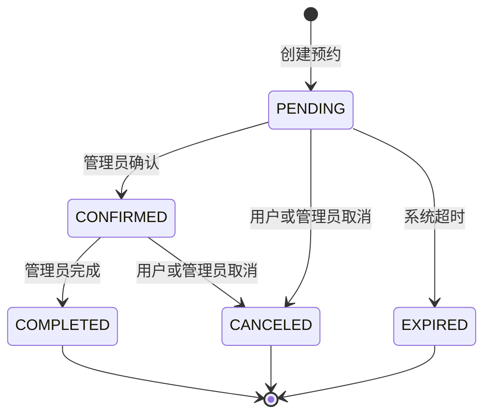
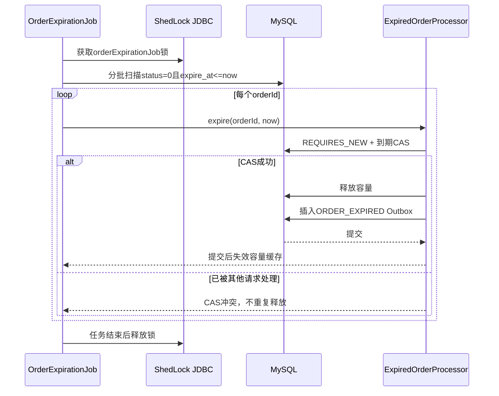
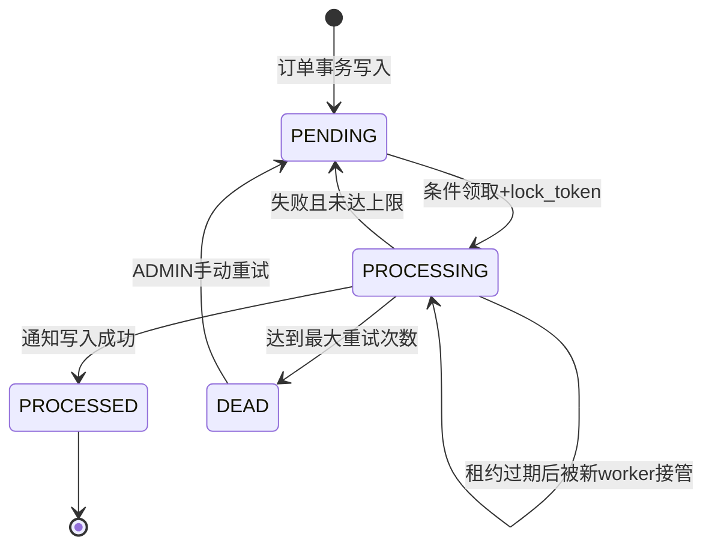

# 订单状态机与可靠事件设计

这份文档说明预约订单如何处理状态流转、超时关闭、容量释放、事务Outbox、失败重试和用户通知。设计目标不是追求复杂中间件，而是在单体MySQL架构中把事务一致性、并发控制、分布式调度和最终一致性做完整。

## 设计目标

- 订单状态变化必须合法、可重复调用且并发安全。
- 订单取消或超时后，容量只能释放一次。
- 订单事务提交后，通知事件不能丢失。
- 多实例重复调度、任务重启和进程中断不能造成重复副作用。
- 单条失败不能阻塞同批其他订单或事件。
- 无需RabbitMQ、Kafka，默认测试也不依赖Docker。

## 订单状态机

状态集中定义在`ExploreOrderStatus`：

| code | 状态 | 含义 |
| --- | --- | --- |
| `0` | `PENDING` | 待商家确认，可确认、用户取消或系统超时 |
| `1` | `CONFIRMED` | 已确认，可完成或用户取消 |
| `2` | `COMPLETED` | 已完成，终态 |
| `3` | `CANCELED` | 用户或管理员取消，终态 |
| `4` | `EXPIRED` | 系统超时取消，终态 |



非法转换统一抛出稳定业务冲突，返回HTTP 409/code 40900。管理员不能手工把订单改成`EXPIRED`，该状态只能由超时处理器写入。

## 数据字段与索引

`explore_order`增加：

| 字段 | 作用 |
| --- | --- |
| `expire_at` | 待确认订单的自动关闭时间 |
| `cancel_type` | `USER`、`ADMIN`或`TIMEOUT` |
| `cancel_reason` | 取消或超时原因 |
| `request_id` | 用户侧幂等键 |

核心索引：

```sql
UNIQUE KEY idx_order_user_request (user_id, request_id)
KEY idx_order_status_expire (status, expire_at)
```

真实MySQL集成测试执行：

```sql
explain select id
from explore_order
where status = 0 and expire_at <= now()
order by expire_at, id
limit 50;
```

并断言执行计划命中`idx_order_status_expire`。

## 事务边界

### 创建预约

`ExploreOrderServiceImpl#create`使用MySQL事务和`READ_COMMITTED`隔离级别：

1. 查询同用户、同`requestId`的订单，存在则直接返回原id。
2. 使用条件更新原子占用项目或套餐容量。
3. 写入订单、`expireAt`和幂等键。
4. 并发请求命中唯一索引时，本事务回滚已占容量，再读取赢家订单并返回其id。

`READ_COMMITTED`保证唯一键竞争失败后能看到另一个事务已提交的赢家订单。

### 业务状态变化

管理员确认、完成、取消和用户取消都在同一事务中完成：

1. 读取订单并校验归属和状态机。
2. `update ... where id = ? and status = ?`执行CAS。
3. 需要取消时释放容量。
4. 插入`order_event_outbox`事件。
5. 一起提交；任一步失败全部回滚。

重复请求若目标状态已经完成，则返回幂等成功，不再释放容量或生成事件。CAS失败说明发生并发写入，重新读取后返回幂等结果或稳定冲突。

### 系统超时

每个到期订单由`ExpiredOrderProcessor#expire`使用`REQUIRES_NEW`独立事务处理。超时CAS同时检查：

```sql
where id = ? and status = 0 and expire_at <= ?
```

因此即使扫描后截止时间被延后，旧任务也不能误关闭订单。状态改为`EXPIRED`、容量释放、取消原因和Outbox事件在一个事务中完成。

项目和套餐列表/详情使用Caffeine L1与Redis L2。超时处理成功后由`CacheInvalidationCoordinator`注册事务提交后失效，清理容量相关项目/套餐详情并递增列表命名空间；回滚时不会发布未提交状态。真实HTTP smoke同时检查数据库容量和用户列表读值，防止出现“数据库已恢复、页面仍显示旧容量”的假一致。

## 超时任务

新订单的`expireAt`由可注入`Clock`和`OrderExpirationPolicy`计算，单测使用固定时钟验证边界。普通测试配置关闭定时任务，`dev`和`prod`配置开启。



可靠性来源：

- ShedLock使用MySQL时间，避免多个应用实例同时执行同一批扫描。
- 扫描按`expire_at,id`排序并限制批量大小，防止长事务。
- 每个订单独立事务，一条失败不会回滚同批其他订单。
- 已提交订单不会再次匹配`PENDING`扫描条件，任务可重复执行。
- 进程中断前未提交的事务自动回滚，重启后仍会被扫描。

## 事务Outbox

`order_event_outbox`保存订单领域事件：

| 字段 | 作用 |
| --- | --- |
| `event_id` | 业务事件唯一ID |
| `event_type` | `ORDER_CONFIRMED`、`ORDER_COMPLETED`、`ORDER_CANCELED`、`ORDER_EXPIRED` |
| `aggregate_id` | 订单id |
| `payload` | 脱敏事件快照 |
| `status` | `PENDING`、`PROCESSING`、`PROCESSED`、`DEAD` |
| `retry_count` | 当前自动重试次数 |
| `next_retry_at` | 下次可领取时间 |
| `locked_until` | 处理租约截止时间 |
| `lock_token` | 本次领取者的随机租约令牌 |
| `last_error` | 脱敏后的最后错误 |



### 为什么需要`lock_token`

仅有`locked_until`不够。旧worker处理时间超过租约后，新worker可以接管；如果旧worker仍按`status=PROCESSING`更新，就可能覆盖新worker结果。

领取时写入随机`lock_token`，完成、重试和DEAD更新都要求：

```sql
where id = ? and status = 'PROCESSING' and lock_token = ?
```

旧worker写入通知后若令牌已失效，状态更新影响0行，整个通知事务回滚；新worker继续处理。这样即使租约过期，也不会由旧worker提交副作用或覆盖重试状态。

### 通知投递与重试

`OutboxEventTransactionService#deliver`在一个`REQUIRES_NEW`事务中：

1. 按`event_id`幂等写入`user_notification`。
2. 携带`lock_token`把Outbox标记为`PROCESSED`。
3. 任一步失败，两步一起回滚。

失败由独立事务记录：第`n`次失败按`baseDelay * 2^(n-1)`计算下次时间，达到上限后进入`DEAD`。错误信息在入库前脱敏并截断，不保存密码、token或完整手机号。

管理员接口仅限`ADMIN`：

```text
GET /admin/outbox-event/page
GET /admin/outbox-event/stats
PUT /admin/outbox-event/{id}/retry
```

手动重试会把`DEAD`事件重新置为`PENDING`并开启一轮新的自动重试，同时通过操作日志留下审计记录。

## 用户通知闭环

`user_notification.event_id`有唯一约束，同一事件重复投递只产生一条通知。Mapper分页、未读数、单条已读和全部已读都携带当前`userId`，访问他人通知统一返回404，避免泄露资源是否存在。

```text
GET /user/notification/page
GET /user/notification/unread-count
PUT /user/notification/{id}/read
PUT /user/notification/read-all
```

React用户端提供通知角标、分页列表、加载/空/失败状态和移动端全宽抽屉。点击订单通知会读取本人订单详情并打开订单抽屉；角标使用独立未读数接口，不会被当前页20条记录覆盖。

## 可观测性

定时任务每批生成`batchId`并写入MDC。日志记录`batchId`、`orderId`或`eventId`、结果和耗时，不记录请求体和敏感字段。

| 指标 | 说明 | 标签 |
| --- | --- | --- |
| `local.explorer.order.expiration.scanned` | 扫描到的到期订单数 | 无 |
| `local.explorer.order.expiration.result` | 关闭、CAS冲突、失败、扫描失败 | `result`固定枚举 |
| `local.explorer.order.expiration.batch` | 超时批次耗时 | 无 |
| `local.explorer.outbox.result` | 成功、重试、DEAD、领取冲突等 | `result`固定枚举 |
| `local.explorer.outbox.batch` | Outbox批次耗时 | 无 |
| `local.explorer.outbox.pending` | 待处理事件数 | 无 |
| `local.explorer.outbox.dead` | DEAD事件数 | 无 |

指标禁止使用userId、orderId、eventId作为标签。Outbox存在DEAD事件时健康状态为`DEGRADED`而不是`DOWN`，不会因少量通知失败把整个业务服务摘除；详细积压通过ADMIN统计接口查看。

## 测试证据

默认Maven测试不依赖Docker，覆盖状态机、超时边界、失败隔离、回滚、重试退避、MockMvc权限和低基数指标。独立Testcontainers测试使用真实MySQL 8验证：

- `(user_id,request_id)`唯一键与并发幂等。
- 两线程超时只能成功一次，容量只释放一次。
- 用户取消与系统超时并发竞争只能成功一个。
- 容量释放失败时订单状态和Outbox一起回滚。
- 旧Outbox租约不能提交通知，新租约可以继续完成。
- 同一事件重复处理仍只有一条通知。
- `EXPLAIN`命中超时扫描索引。
- HTTP创建、超时、容量恢复和通知查询闭环。

```powershell
.\mvnw.cmd test
.\mvnw.cmd verify -Pintegration-test
node --test explorer-web\src\test\js\*.test.cjs
```

真实运行smoke需要把IDEA后端超时临时调到1分钟：

```text
ORDER_PENDING_TIMEOUT_MINUTES=1
ORDER_EXPIRATION_DELAY_MS=1000
OUTBOX_DELAY_MS=500
```

重启后端，再运行：

```powershell
powershell -NoProfile -ExecutionPolicy Bypass -File scripts\smoke-order-reliability.ps1
```

脚本会真实验证重复预约返回同一id、容量只占一次、系统超时、容量恢复、通知可见和已读状态。

## 演进到MQ

当前规模使用MySQL Outbox和定时投递，减少额外基础设施。需要拆服务时可以平滑演进：

1. 保留订单事务内写Outbox，不改变业务事务边界。
2. 将当前通知消费者替换为Outbox Relay，发布到RabbitMQ或Kafka。
3. 使用`event_id`作为消息键和消费者幂等键。
4. 消费者继续用唯一约束防重复副作用。
5. 发布确认后再把Outbox标记为`PROCESSED`，失败沿用重试和DEAD运维能力。

## 面试讲法

> 我没有让定时任务直接“查到就改”。订单关闭使用带到期条件的CAS，状态、容量释放和Outbox在同一事务提交；每笔超时订单用独立事务，ShedLock只负责避免多实例重复扫描，CAS负责最终并发正确性。Outbox领取使用带随机令牌的租约，旧worker租约失效后不能提交通知或覆盖新worker状态；通知表再用eventId唯一约束保证业务幂等。失败按指数退避，超过上限进入DEAD，由管理员查询和重试，日志、指标和健康状态形成运维闭环。
