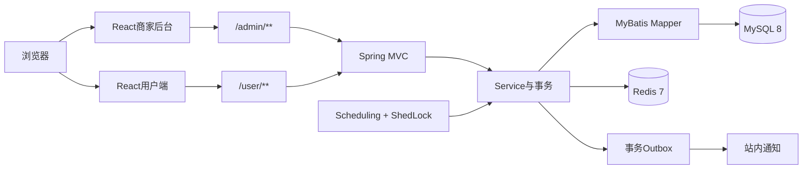
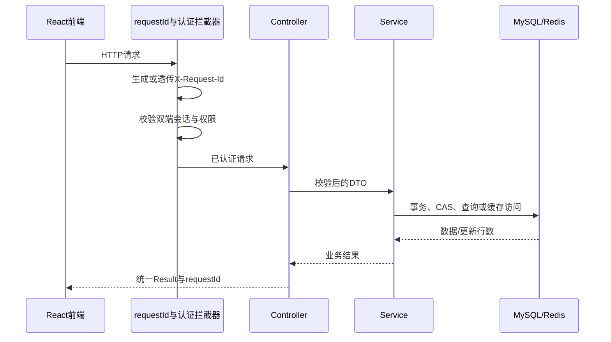

# 系统架构

## 总体结构

系统采用Maven多模块后端和Vite多入口前端。管理端与用户端共享业务服务，但使用不同的接口前缀、认证配置和权限边界。

## 模块职责

| 模块 | 职责 |
| --- | --- |
| `explorer-common` | 通用结果、异常、常量、上下文、配置属性与基础工具 |
| `explorer-model` | Entity、DTO、VO和分页模型 |
| `explorer-web` | Controller、Service、Mapper、拦截器、AOP、定时任务和应用入口 |
| `explorer-web/frontend` | React管理端、React用户端、Vite构建和Playwright场景测试 |
| `docs` | 初始化SQL、迁移SQL、架构设计、测试证据和面试材料 |

## 请求链路

Controller负责协议适配和参数校验；Service负责业务状态、权限后的业务约束与事务；Mapper负责数据库访问。写操作通过统一异常映射输出稳定HTTP状态和业务错误码。

## 数据与一致性边界

- MySQL保存员工、用户、内容、订单、会话、Outbox、通知、导出任务和运行配置，是核心事实来源。
- Redis保存公共热数据、浏览记录、收藏记录和跨实例缓存失效消息；Redis不可用时，核心业务仍以MySQL为准。
- 预约容量通过条件更新原子占用，订单转换通过CAS限制当前状态，避免并发超卖和重复释放。
- 订单状态变化和Outbox事件在同一事务提交；异步处理器通过租约、重试和唯一约束实现最终一致。
- 定时任务使用ShedLock JDBC协调多实例，每条订单或事件使用独立事务，单条失败不阻塞整个批次。

## 认证与授权边界

管理端和用户端使用独立Header、Cookie Path、JWT secret与`principalType`。Access Token只负责短期身份表达，Refresh Token由MySQL会话记录支持轮换、撤销和重放检测。

后台权限分为`ADMIN`和`STAFF`。高风险接口通过统一授权拦截器与`@RequireAdmin`保护，前端隐藏入口只能改善体验，后端鉴权才是最终边界。

## 可观测与验证

- `X-Request-Id`贯穿响应、MDC和错误日志。
- Actuator提供健康信息，Micrometer记录接口、缓存、预约、Outbox和异步任务指标。
- JUnit/Mockito验证Service行为，MockMvc验证协议与权限，Testcontainers验证真实MySQL/Redis约束和并发。
- Playwright与smoke脚本验证浏览器页面、认证、订单、通知和异步导出闭环。

继续阅读：[后端工程设计](BACKEND_DESIGN.md)、[数据库设计](DATABASE_DESIGN.md)、[订单可靠性](ORDER_RELIABILITY.md)、[测试与验证](TESTING.md)。
